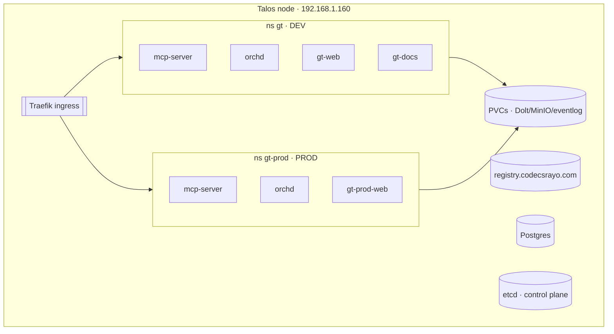

# Cluster topology

The platform runs on a **single-node Talos Kubernetes cluster** (Talos v1.13.4)
at `192.168.1.160`. One node hosts **two environments** — dev and prod — side by
side, plus the shared infrastructure services.

## Two environments, one node

| | Dev | Prod |
| --- | --- | --- |
| Namespace | `gt` | `gt-prod` |
| Host | `gt-dev.codecsrayo.com` | `gt.codecsrayo.com` |
| Dev loop | Tilt (edit → build → push → redeploy) | Helm + reconcilers |
| Images | internal registry `:dev` | Docker Hub `:sha-…` |

Prod is greenfield — the box was the old prod host, wiped for Talos, so there is
no migrated data.

## Config access

- `talosctl` v1.13.4; `TALOSCONFIG=talos/_out/talosconfig`.
- `KUBECONFIG=talos/_out/kubeconfig` (context `admin@gt-core`).
- Machine config applied with
  `talosctl apply-config -n 192.168.1.160 --file … --mode=auto`.

Talos enforces the PodSecurity **baseline** cluster-wide; a namespace that needs
`hostPath`/`hostPort` must be labeled
`pod-security.kubernetes.io/enforce=privileged`.

> **Improvement areas.** etcd, dev, and prod share one NVMe. Rust build I/O from
> agents has saturated it and stalled etcd — a dedicated disk for etcd is the
> definitive fix (see [operational gotchas](/infrastructure/operational-gotchas)).
