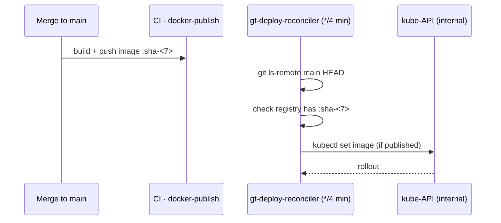

# Deploy reconcilers

Dev and prod images track `main` **automatically**, without a GitHub-hosted
deploy job. In-cluster **CronJobs** reconcile each deployment against the image
built for `main`'s HEAD, running every 4 minutes against the internal kube-API.

## What reconciles

- **gt-core**: `orchd` (`gt-core-orchd:sha-<7>`) and `mcp-server`
  (`gt-core-mcp-server:sha-embeddings-<7>`). Prod's orchd runs the embeddings
  image too.
- **gt-web**: a separate reconciler instance (its own repo → its own SHA),
  `codecsrayo/gt-web:sha-<7>`, same image in dev and prod.

There is no Argo/Flux: the chart is applied by hand with
`helm template <release> … --show-only templates/<t>.yaml | kubectl apply -n <ns>`
(the `-n` is mandatory, or resources land in `default`). The reconcilers keep
images current when Tilt is not running. `gt-docs` prod is currently promoted
manually.

## Two known race/robustness notes

1. **ImagePull race** — the reconciler pins the SHA the moment `main` merges, but
   `docker-publish` takes ~10–13 min. There is a window where the requested image
   doesn't exist yet and the pod sits in `ImagePullBackOff`; it self-heals when
   the image publishes. Do not intervene.
2. **Registry-check gate** — the reconciler blocks the roll **only** on a
   definitive `404`; it proceeds on `200/000/401/5xx` and lets the kubelet's pull
   backoff absorb a transient miss (a flaky Docker Hub token used to stall it).

> **Improvement areas.** A reconciler can roll a *broken* image at `main` HEAD
> (e.g. a crash-looping PG migration). Stabilize by suspending the CronJob and
> `kubectl set image` to a known-good SHA until the fix lands.
