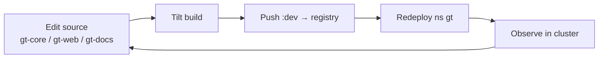

# Dev loop (Tilt)

The dev environment (namespace `gt`, `gt-dev.codecsrayo.com`) is driven by a
**Tilt** inner loop. You edit source in the local clones, and Tilt builds,
pushes to the internal registry, and redeploys into the cluster.

## Repos

| Repo | Role |
| ---- | ---- |
| `gt-core` | Rust MCP server / orchd / platform |
| `gt-app-proxy` | Helm chart + deploy runbook |
| `gt-web` | SvelteKit console (SSR) |
| `gt-docs` | Astro docs (SSR) — this site |

The infra-as-code (Tiltfile, chart values, patches, runbook) lives in the
`gt-cluster` repo, whose git tree is rooted at `/home/nixos/talos`.

## Dev vs the reconcilers

Tilt is the **dev loop**; the [deploy
reconcilers](/infrastructure/deploy-reconcilers) keep images current when Tilt is
not running. Both target the same namespace `gt`, so a running reconciler will
roll a dev deployment to `main` HEAD if Tilt has released control.

> **Improvement areas.** Building Rust images pressures the shared NVMe. Keep the
> pool bounded and prefer building off-node or with a warm cache to avoid
> competing with etcd I/O.
