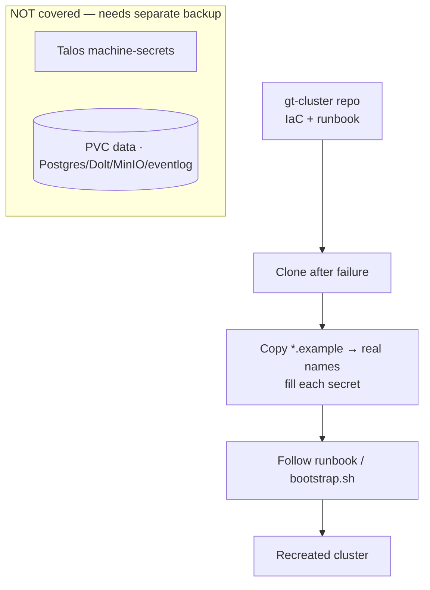

# Disaster recovery

The cluster's infrastructure is versioned as code in the **public `gt-cluster`
repo** so it can be recreated if the workstation fails. It captures the Tiltfile,
the deploy runbook, chart values, and the Talos patches — with all secrets
omitted.

## What is versioned

Tiltfile, runbook, `bootstrap.sh`, PSA labels, dev/prod values, registry and
Traefik values, and the Talos patches. Two inline secrets were replaced by
placeholders in `*.example` files: the registry htpasswd and the Tailscale
auth key. Recovery = clone → copy each `*.example` to its real name and fill the
secret → follow the runbook.

## The two gaps

Full disaster recovery is **not** covered by the repo alone:

1. **Talos machine-secrets** — the machine certs/tokens (in `_out/`) are
   gitignored and not backed up.
2. **The data** — Postgres, Dolt, MinIO, and the event log live in PVCs; they
   need a separate backup.

Both require a backup mechanism outside the IaC repo.

> **Improvement areas.** Close the two gaps with scheduled, off-node backups of
> the Talos machine-secrets and the PVC volumes; without them, a node loss is
> data loss even though the infra is reproducible.
