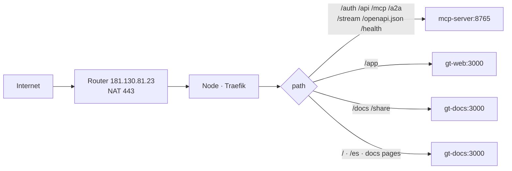

# Networking & routing

Everything is served **same-origin** behind one Traefik reverse proxy per
environment. A standard Ingress resolves by longest-prefix match, so explicit API
and app paths win over the `/` catch-all.

## Path map

| Path | Backend |
| ---- | ------- |
| `/auth` `/api` `/mcp` `/a2a` `/stream` `/openapi.json` `/health` `/.well-known` | mcp-server:8765 |
| `/app` | gt-web (console) |
| `/docs` `/share` | gt-docs (workspace browser + share viewer) |
| `/` · `/es` · `/<category>/<slug>` | gt-docs (this documentation site) |

> This map reflects the **docs-at-root** layout: the documentation site owns `/`
> and the gt-web console moved to `/app`. Reserved prefixes above must not be used
> as top-level doc slugs, which is why doc pages live under `/<category>/<slug>`.

## Public path & TLS

The router (`181.130.81.23`) NATs `443` to the node; public hostnames terminate
at in-cluster Traefik. TLS is issued via **Let's Encrypt DNS-01 through Netlify**
(ACME resolver `netlify`); Ingresses use the Traefik annotations
`router.entrypoints=websecure` + `router.tls.certresolver=netlify`, with
`ingress.tls.enabled=false`.

> **Improvement areas.** All public traffic funnels through one home router NAT
> and one node. There is no redundancy; an outage of either takes both dev and
> prod offline.
