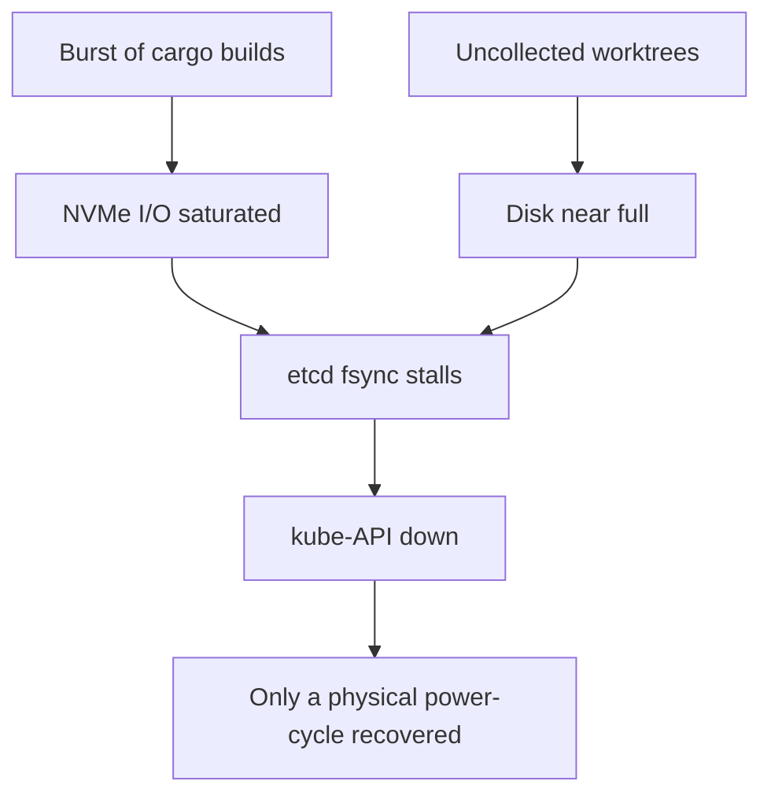

# Operational gotchas

The lessons that cost an incident. Read these before operating the cluster.

## kube-API over LAN, not Tailscale

`kubectl` against the Tailscale endpoint (`100.76.199.82:6443`) can hang with a
TLS handshake timeout from the workstation even while the cluster is healthy.
Point at the **LAN endpoint** instead — the API cert covers it, so no
`--insecure` flag is needed:

```
kubectl config set clusters.gt-core.server https://192.168.1.160:6443
```

## etcd I/O saturation on the shared NVMe

Agent Rust builds plus dev/prod all share one NVMe. A burst of `cargo build` has
saturated I/O, pushed etcd `fsync` into multi-second territory, and taken the
kube-API down; a disk leak from ungarbage-collected worktrees made it worse.



With etcd starved, `kubectl` and `agent_kill` both time out, and a software
reboot wedges on the hung disk — the only exit was a **physical power cycle**.
Cured at the root by worktree GC + a disk-aware orchestrator; the pool is bounded
(`poolSize` 4, dev 6) and a **dedicated etcd disk** is the definitive fix still
tracked.

## Never run tests against the live database

An agent test suite once ran `DROP SCHEMA … CASCADE` against the live Postgres
and wiped the dev workspace. The polecat exec now strips `GT_PG_URL` /
`GT_PG_AUDIT_URL` / `GT_DOLT_URL` so no agent test can reach prod data. Tests must
assert an **ephemeral** DSN before touching a database.

## Reverting a persisted event needs a tombstone

For an event-sourced domain, you cannot delete a variant once it has written
events — replay would fail with `unknown variant` and break every consumer.
Revert by leaving a **tombstone**: the variant still decodes (same shape) but its
`apply` is a no-op and it is never emitted again.

> **Improvement areas.** Most of these were caught after the fact. Add
> pre-merge guards (ephemeral-DSN assertions, event round-trip tests) and disk/
> etcd-latency alerts so the next one is caught before it pages.
