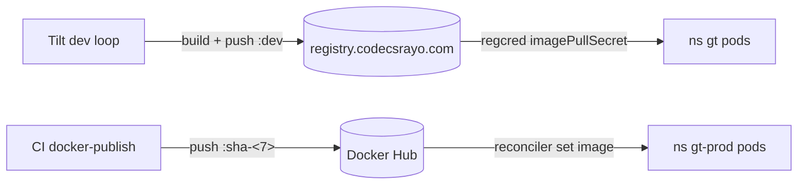

# Registry & images

The cluster runs an **in-cluster container registry** at
`registry.codecsrayo.com` (Let's Encrypt TLS + basic auth). Dev images are
pushed and pulled from it; prod images come from Docker Hub via the reconcilers.

## Image variants

| Image | Where | Notes |
| ----- | ----- | ----- |
| `gt-core-mcp-server:sha-embeddings-<7>` | dev + prod | Heavy embeddings variant the cluster runs |
| `gt-core-orchd:sha-<7>` | dev | Lean orchd (prod orchd runs the embeddings image) |
| `codecsrayo/gt-web:sha-<7>` | dev + prod | Single lean image, no embeddings variant |
| `codecsrayo/gt-docs` | dev + prod | This docs site |

## Pull authentication

Each app namespace pulls via a `regcred` **imagePullSecret**. Talos
`machine.registries.config.auth` does **not** work here — containerd doesn't
reload it and CRI can't be restarted via the API — so per-namespace pull secrets
are the mechanism.

> **Improvement areas.** The registry basic-auth password lives in cluster
> secrets and (sanitized) as a placeholder in the infra repo. Rotating it means
> updating every namespace's `regcred`; a single sourced secret would reduce
> drift.
