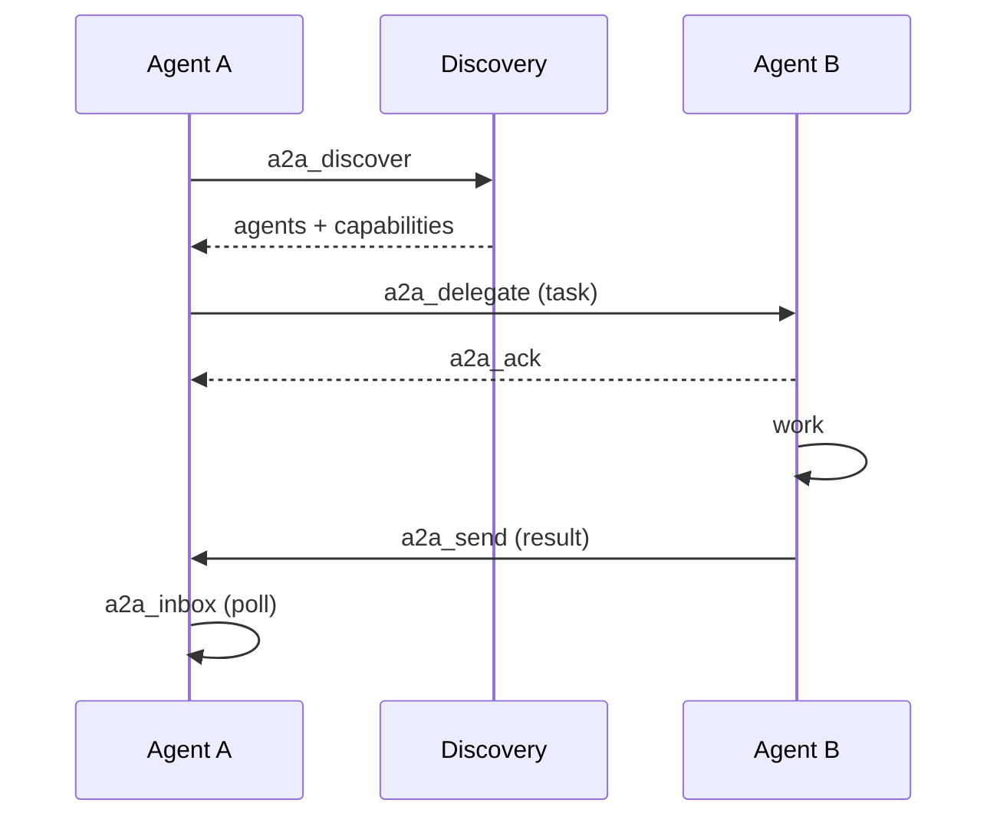

# Agent-to-agent (A2A)

Agents don't only take work from the frontier — they can talk to each other.
**A2A** is the messaging and delegation surface, exposed both over MCP tools and
a public `/a2a` HTTP endpoint with an agent card.

## Primitives

| Tool | Purpose |
| ---- | ------- |
| `a2a_discover` | Find agents and their capabilities |
| `a2a_delegate` | Hand a task to another agent |
| `a2a_send` | Send a message |
| `a2a_inbox` | Read incoming messages |
| `a2a_ack` / `a2a_status` | Acknowledge / check delegation state |

## Access control

A2A is governed by granular RBAC. A role is granted only the exact scopes it
needs (`a2a.inbox`, `a2a.delegate`, …) — never a wildcard like `a2a.*`. The
policy lives in the security layer (the sheriff role), not ad hoc at each call
site. See [workspaces & security](/platform/workspaces-and-security).

> **Improvement areas.** A2A delegation crosses trust boundaries; ensure every
> delegated task carries the delegator's scope context so a delegate cannot
> escalate beyond what the delegator itself holds.
