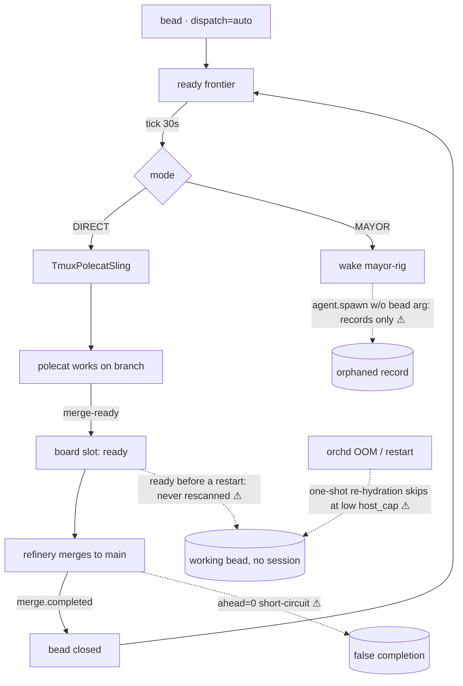

# Agent work loop

This page audits the **full autonomous loop** — from an open bead to a merged
commit and a closed bead — stage by stage, marking what is implemented, what is
partial, and what is broken. Every claim below is grounded in gt-core source
(symbols named) or in the 2026-07-01/02 production incident. For the concepts
themselves see [dispatch](/platform/dispatch) and
[roles & agents](/platform/roles-and-agents).

## Stage status

| Stage | Mechanism | Status |
|---|---|---|
| Frontier | `FrontierSource` + readiness + `resolve_dispatch` | ✅ solid |
| Dispatch DIRECT | `SchedWorker` slings per bead, retries every tick | ✅ solid |
| Dispatch MAYOR | wake file + mayor session delegates | ⚠ **broken edge** (G1) |
| Sling | credential guard → worktree → tmux → prompt | ⚠ partial (G3, G4) |
| Work | commits + checkpoint-push + `## Checkpoint` notes | ✅ solid |
| Crash recovery | supervisor re-sling (`max_restarts=3`), session reconciler | ⚠ partial (G2) |
| Merge | refinery consumes MERGE_READY channel | ⚠ partial (G5) |
| Close | `merge.completed` → bead close | ⚠ can close undelivered work (G5) |

When every edge holds, the loop **does** deliver end-to-end with no human:
gt-web PR #30 (session-expired 401 polling fix, 42 lines on the bead's exact
surface) was implemented, submitted, merged and closed autonomously on
2026-07-02.

## Verified gaps

**G1 — the mayor cannot actually sling.** `mayor_prompt`
(`mayor_dispatch.rs`) tells the mayor to "delegate through the MCP tools" but
never names the one call that materializes work: `agent.spawn` **with the
`bead` argument**, whose handler (`mcp/agent.rs`) bridges to the orchd
scheduler *only* when a dispatch sink is wired — otherwise "spawn only records
the event", and the bridge is explicitly best-effort ("a failure logs but
never fails the spawn call"). Observed 2026-07-02: a mayor "re-slung" six
beads; all six were tracker records with no tmux process, orphan-killed by the
session reconciler ~2 min later, silently. The cluster was switched to DIRECT
until this edge is fixed.

**G2 — boot re-hydration is one-shot and cap-blind.** After a restart the
orchd re-slings `working` beads once. `host_cap_from_metrics` → `compute_host_cap`
(polecat.rs) gates admission on RAM + IO PSI; right after an OOMKill those
metrics are depressed, so the cap can compute to 1 and the re-hydration skips
the rest (`sling skipped … pool/host cap reached`). The cap itself recovers on
a timer, but **nothing ever retries the skipped beads**: a `working` bead with
no session is invisible to the frontier forever. Two OOMKills on 2026-07-01/02
each orphaned ~6-8 beads this way; recovery required an operator transitioning
them back to `open`.

**G3 — interactive dialogs eat the sling prompt.** A freshly slung `claude`
session can land on the folder-trust dialog or a feature-promo dialog; the
injected bead prompt is consumed by the dialog and the polecat idles at an
empty prompt, heartbeating, indistinguishable from a working agent.

**G4 — a dead credential can pass the sling guard.** An account whose
`.credentials.json` lost its access token still reads `Refreshable` /
`needs_relogin=false` in `quota.cred_health`; a polecat slung on it is born at
"Not logged in" while its bead sits `working`.

**G5 — the refinery trusts the board, not git.** Three related holes: (a) it
only consumes the MERGE_READY *channel* — slots already `ready` before a
restart are never rescanned; (b) `failed` is terminal (70/108 slots at audit
time) with no `merge_reset`; (c) the ahead=0 short-circuit (commit `4f9d9bc`)
marks a slot `merged` when the branch has no commits over main — which
**closed bead gtcore-4ad682 with `delivered_sha=null` while its feature
(`merge_reset` itself, ironically) does not exist in the codebase**. The loop
can report work done that never happened.

**G6 — daemons don't heartbeat.** sheriff/deacon/refinery session records
carry `last_heartbeat_at=null`, so a zombie daemon is indistinguishable from a
live one in `agent.list`.

**G7 — board/git desync.** Slot `gtcore-065009` still reads `ready` while a
session-retention commit matching its scope sits at main HEAD; slot
`gtcore-4ad682` reads `merged` with nothing landed. Neither direction is
reconciled against git truth.

## Open beads closing these gaps

Epic `gtcore-9d8e6b` tracks the audit's new bugs: `gtcore-d24661` (mayor
delegation edge — G1, PR #164), `gtcore-03be6a` (ahead=0 evidence gate —
G5c, PR #165) and `gtcore-f527f6` (cap-parked sling retry — G2, PR #166).
Already tracked elsewhere: `gtcore-088db9` (refinery board reconcile at boot
— G5a), `gtcore-b69087` (daemon restart — G1/G6 adjacent), `gtcore-efb7e6`
(daemon heartbeats — G6), `gtcore-f396dc` (sling-prompt dialogs — G3),
`gtcore-945c70` (credential guard — G4), plus the reopened `gtcore-4ad682`
(merge_reset — G5b).

> **Improvement areas.** The deepest issue is that failure is *silent* at
> every broken edge: a spawn that materializes nothing, a skipped re-sling, a
> prompt eaten by a dialog, and an ahead=0 "merge" all leave the tracker
> looking healthy. Every gap fix should carry an operator-visible signal
> (notification or heartbeat), not just the state change.
