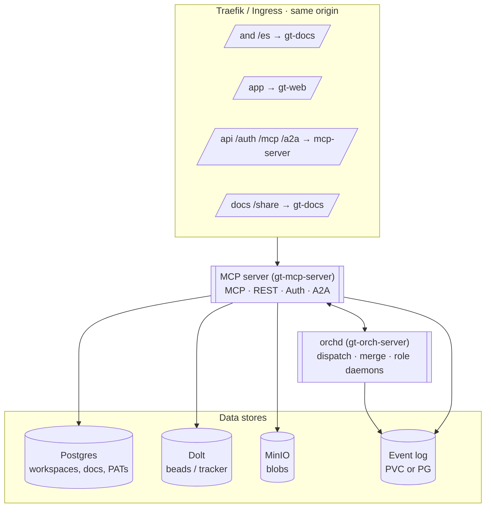

# Architecture

Two Rust binaries make up the platform runtime, plus two SSR frontends and a set
of data stores. Everything is same-origin behind one reverse proxy.

## Components

- **MCP server** (`gt-mcp-server`) — the front door. Serves the MCP tool surface,
  the REST API (`/api/v1`), auth (`/auth`), and agent-to-agent (`/a2a`). Owns the
  data stores.
- **orchd** (`gt-orch-server`) — the singleton orchestrator. Runs the dispatch
  loop, the merge daemon (refinery), and the role daemons. Forks agent sessions
  (`claude` in tmux) in-pod.
- **gt-web** — SvelteKit SSR console, served under `/app`.
- **gt-docs** — Astro SSR docs, served at `/` (this site) plus the `/docs`
  workspace browser and the public `/share` viewer.

## Data stores

| Store | Holds |
| ----- | ----- |
| **Postgres** | Workspaces, users, PATs, rig catalog, memories, documents, comments |
| **Dolt** | Beads / tracker (versioned) |
| **MinIO** | Document blobs |
| **Event log** | Domain events for replay (file-backed PVC in dev, PG-backed option) |

Several domains are **event-sourced**: state is a replay of an append-only log.
That makes reverts subtle — see [beads & epics](/platform/beads-and-epics) and
the tombstone rule in [operational gotchas](/infrastructure/operational-gotchas).

> **Improvement areas.** The MCP server relies on migration bookkeeping to create
> per-workspace tables; a boot-time `ensure_schema` (CREATE TABLE IF NOT EXISTS)
> would let a dropped table self-heal instead of needing a manual re-apply.
