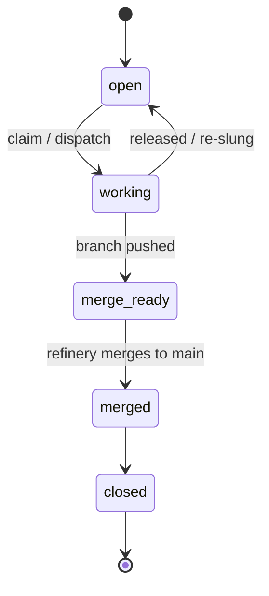

# Beads & epics

A **bead** is the atomic unit of work — a bug, task, or feature. An **epic** is a
container: it has no code of its own, and its delivery is the sum of its child
beads, each merged on its own branch. An epic closes when all its children land.

Every change follows the same flow, in order:

1. **Create** the bead/epic.
2. **Edit** with enough context — the *why*, scope, links.
3. **Claim** it.
4. **Resolve** — do the work on a branch.
5. **Update** — record the outcome.
6. **Close.**

The point is traceability: work is tied to an item with history, never to loose
changes with no origin.

## Lifecycle

## Dispatch flag

A bead carries a **dispatch** setting:

- `auto` — the orchestrator may pull it into the ready *frontier* and dispatch it.
- `manual` — it never enters the frontier on its own (except an active convoy
  member, via the convoy gate).

To hand work to the agents, set the leaf beads to `dispatch=auto`; the orchd
frontier (`GT_AUTO_DISPATCH_TICK_SECS=30`) picks them up.

## Rules for agents

- An agent slung onto an **epic** must **not** implement or merge it — it lists
  the children and stops.
- An agent re-slung onto a bead whose deliverable is **already merged** (stale
  branch) must **not** re-merge — re-merging a stale branch reverts newer work.
  It surfaces a note and stops.

Both are hard "surface + stop" cases; the correct channel is a note on the bead.

> **Improvement areas.** Boot re-hydration of the orchd has historically
> re-slung closed/epic/`manual` beads; the frontier must exclude
> `issue_type=epic` and honor `dispatch=manual` on rehydrate to avoid duplicate
> or destructive work.
