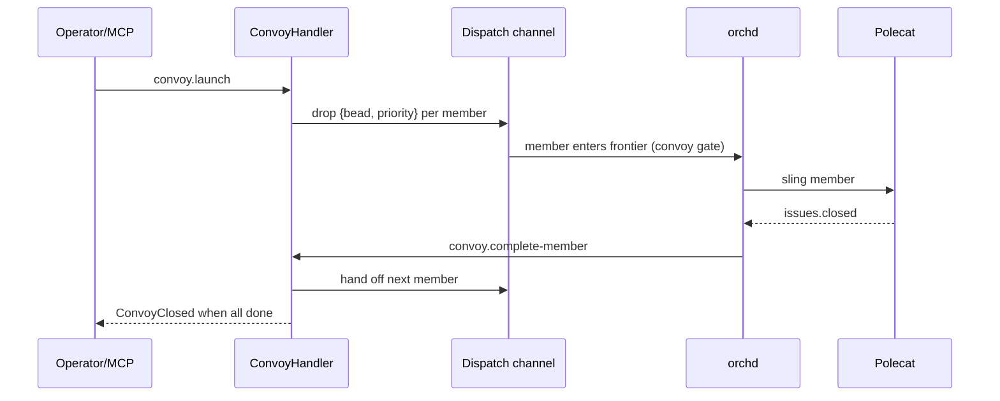

# Convoys

A **convoy** is a coordinated group of beads that should be worked together. It
has members, each of which becomes a dispatchable unit, and it advances as its
members complete.

## The two gaps that had to be closed

Convoys did not advance end-to-end until two gaps were fixed:

1. **Dispatch gate** — members are `dispatch=manual`, so the slingability check
   skipped them. A **convoy override** now lets an *active member of a launched
   convoy* be slung despite `manual` (closed/epic beads still blocked).
2. **Completion** — nothing translated `issues.closed` into
   `convoy.complete-member`. A **completion plugin** now reacts to `issues.closed`
   and either hands off the next member or closes the convoy.

The bridge from `convoy.launch` to the dispatch channel was already wired; these
two additions made the loop autonomous.

## Manual controls

If a convoy is stuck, an operator can still advance it by hand with
`convoy.complete-member` / `convoy.reconcile`, or by flipping a member bead to
`dispatch=auto`.

> **Improvement areas.** Convoy progress depends on the orchd emitting agent
> lifecycle events; make sure re-slings and reconciles are idempotent so a
> replayed `issues.closed` cannot double-hand-off a member.
