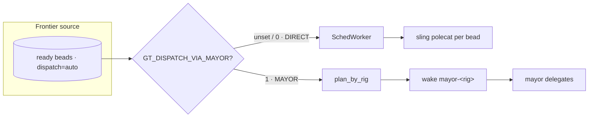

# Dispatch

The orchd auto-dispatch loop reads the ready **frontier** (eligible beads) and
turns it into agent work. It runs in one of two modes, selected by
`GT_DISPATCH_VIA_MAYOR` and gated on `GT_AUTO_DISPATCH=1`.

## DIRECT mode

Legacy behavior: the orchd owns dispatch. `FrontierSource → SchedWorker` slings a
polecat per bead, and a completion plugin frees the slot when the bead lands.

## MAYOR mode — current

The cluster runs **MAYOR mode** (`dispatchViaMayor: true`). The dispatcher groups
the frontier by rig prefix and wakes **one mayor per rig** (a tmux session
`mayor-<rig>`), handing it the ready frontier. The mayor coordinates
bead-by-bead and delegates to polecats, and announces itself as an observable
session. Wake-on-task: an empty frontier wakes no one (≈0 idle tokens); a mayor
that dies is re-slung on the next tick if that rig still has work.

## Credentials

A mayor session resolves credentials at spawn time (keychain + quota), the same
way a polecat does, so it is never born unauthenticated. Aborting the spawn when
no valid account exists is preferred over launching a mayor that would 401.

## Handing out work

Set leaf beads to `dispatch=auto`; the orchd frontier tick
(`GT_AUTO_DISPATCH_TICK_SECS=30`) feeds them in and the rig's mayor delegates. A
`dispatch=manual` bead never enters the frontier unless it is an active convoy
member.

> **Improvement areas.** Restarting the orchd kills in-flight polecat tmux
> sessions and re-orphans their beads. Config changes that require an orchd
> restart should be batched and timed against a quiet frontier.
