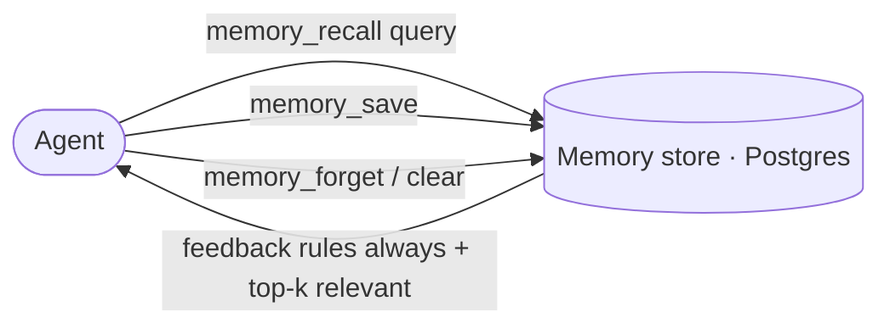

# Memory

The platform keeps a durable, MCP-backed **memory** — facts the agents recall
before acting and save as they learn. It is the single source of truth for
operational knowledge; it is **not** stored in scattered local files.

## Kinds

| Kind | What it holds |
| ---- | ------------- |
| **user** | Who the operator is — role, preferences |
| **feedback** | How agents should work — corrections and confirmed approaches, with the *why* |
| **project** | Ongoing work, goals, constraints not derivable from code |
| **reference** | Pointers to how-tos, endpoints, external resources |

## Recall semantics

`memory_recall` **always** returns every `feedback` rule in full, plus the top-k
of the rest by relevance. That guarantees behavioral rules are never missed,
while project/reference facts are pulled in by meaning.

## Hygiene

- One fact per memory; update the existing file rather than duplicating.
- Convert relative dates to absolute.
- Delete memories that turn out wrong.
- Link related memories so a topic stays navigable.

Recalled memories reflect what was true when written — verify a named file,
flag, or endpoint still exists before acting on it.

> **Improvement areas.** Memory can drift from the live system (a named flag or
> table may have moved). A periodic reconcile that flags stale references would
> keep recall trustworthy.
