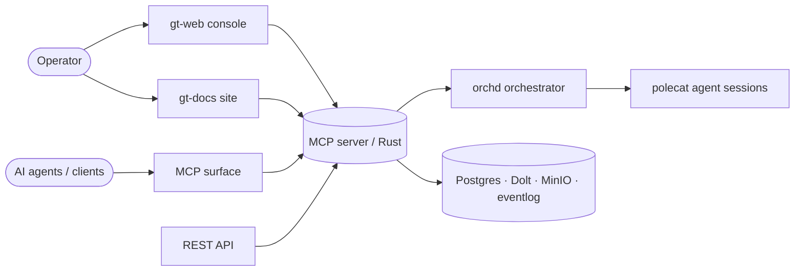

# Platform overview

**gt** is a self-hosted platform for driving software work with AI agents. A Rust
backend (the **MCP server**) exposes the system over several surfaces; an
orchestrator (**orchd**) dispatches agent sessions that claim units of work,
implement them on their own git branches, and merge back to `main`.

Every change flows through a tracked unit of work — a **bead** (or an **epic**
grouping beads). Agents pick up ready beads, do the work, and land it. Human
operators observe and steer through the web console and the documentation you are
reading now.

## Surfaces

| Surface | Path | Audience |
| ------- | ---- | -------- |
| Console (gt-web) | `/app` | Operators — tracker, kanban, agents, admin |
| Docs (gt-docs) | `/` · `/es` | Anyone — system documentation (this site) |
| Workspace docs | `/docs` | Signed-in users — uploaded documents + search |
| MCP | `/mcp` | Agents / Claude clients — tools over MCP |
| REST | `/api/v1/*` | Programmatic clients + webhooks |
| Auth | `/auth/*` | Login, session, OIDC providers |

## Core concepts

- **Beads & epics** — the unit of work and its lifecycle.
- **Roles & agents** — mayor, polecat, refinery, sheriff, witness, deacon.
- **Dispatch** — how ready work reaches an agent (DIRECT vs MAYOR mode).
- **Convoys** — coordinated multi-member work.
- **Memory** — durable knowledge the agents recall and save.
- **Quota & credentials** — model access, rotated across accounts.
- **Workspaces & security** — tenancy and granular RBAC.

> **Improvement areas.** This site documents the system *as it runs today* so
> gaps are easy to spot. Each page ends with an improvement note where a known
> weakness or open decision exists.
