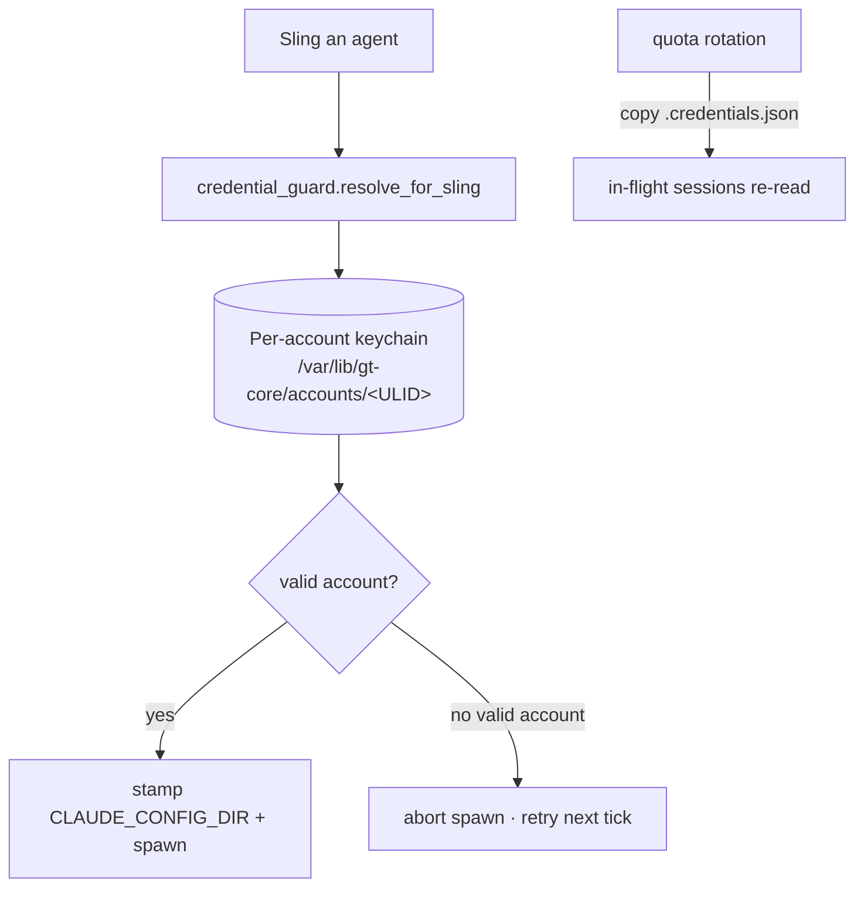

# Quota & credentials

Agents run the `claude` CLI, which needs valid model credentials. The platform
manages a pool of accounts (**quota**) and resolves the right credential for each
agent session, rotating across accounts as they are exhausted.

## Per-session resolution

Both polecats and mayors resolve credentials **per sling** via the credential
guard, stamping `CLAUDE_CONFIG_DIR` to a persistent per-account keychain dir on
the PVC. A session is never launched against a dead account: if no valid account
exists the spawn aborts and the frontier retries on the next tick.

## Hot rotation

On quota rotation the new account's `.credentials.json` is copied into every
in-flight agent's config dir; the CLI re-reads it, so long-running sessions keep
working without a restart.

## Why sessions were born in 401

The orchd pod uses `HOME=/tmp`, so a **pod restart wipes credentials** — they
must be re-provisioned before dispatching. Historically the mayor waker used a
static boot-time environment snapshot and inherited a stale account; it now
resolves credentials at spawn time like the polecat.

> **Improvement areas.** Because credentials live under the pod's ephemeral
> `HOME`, provisioning must run on every restart. Persisting the resolved
> keychain path independently of `HOME` would remove that per-restart step.
