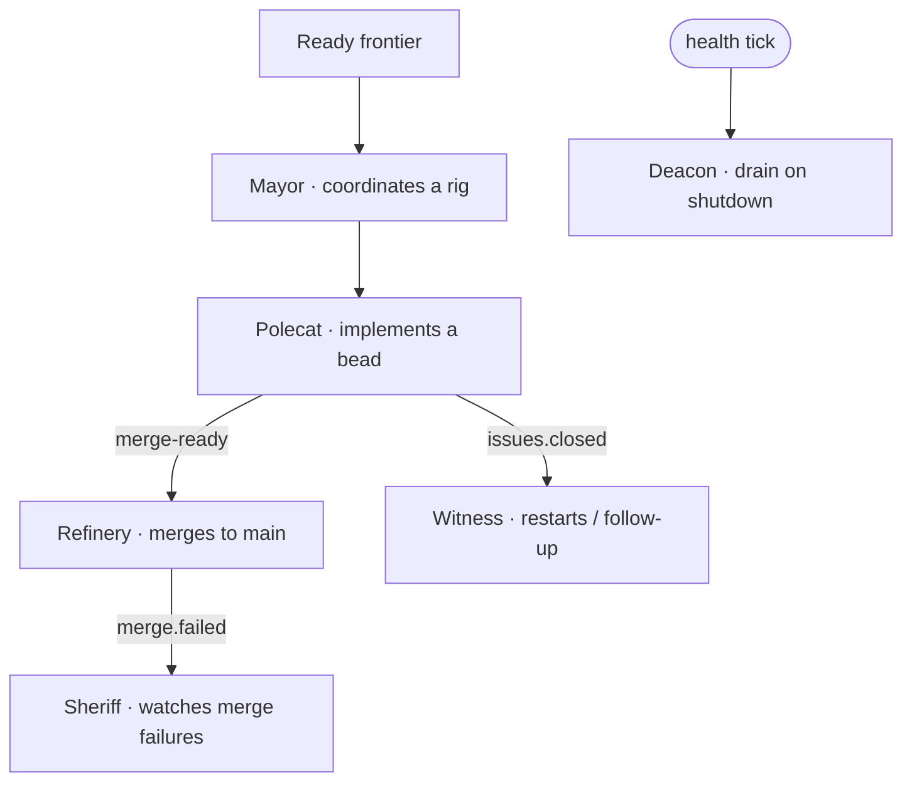

# Roles & agents

Work is carried out by agent sessions with distinct roles. Some are spawned by
operators/coordinators; the infrastructure roles are managed by the orchd daemon.

| Role | Job | How it runs |
| ---- | --- | ----------- |
| **Mayor** | Coordinates a rig; decides bead-by-bead and delegates | tmux session per rig (`mayor-<rig>`) |
| **Polecat** | Implements one bead on its own branch | tmux `claude` session (visible in `agent_list`) |
| **Refinery** | Merges `merge-ready` branches to `main` | in-process loop on orchd |
| **Sheriff** | Watches merge failures; owns RBAC policy | single-shot agent (role-agents on) |
| **Witness** | Reacts to `issues.closed` | single-shot agent |
| **Deacon** | Drains worktrees on shutdown | single-shot agent |

## Who can spawn what

`agent_spawn` only accepts `mayor`, `dog`, and `polecat`. The infrastructure
roles (refinery, sheriff, witness, deacon) are launched by the orchd daemon — a
coordinator **cannot** spawn them. If the merge queue is stuck with no refinery,
the fix is to escalate to the operator/daemon, not to spawn one.

## Observability

With **role-agents mode on** (the current setting), sheriff/witness/deacon run as
single-shot agent sessions that announce themselves (`agent.spawned` /
`session-end` → `agent_list` + audit) instead of invisible in-process loops. The
refinery still runs as an in-process loop on the orchd.

> **Improvement areas.** The refinery does not yet announce itself as an agent
> session (it is a queue consumer). Emitting its lifecycle would close the last
> gap in "every role is an observable session."
