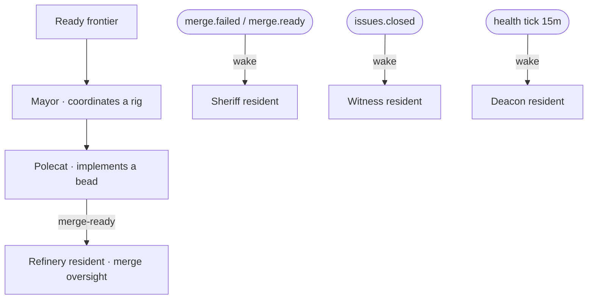

# Roles & agents

Work is carried out by agent sessions with distinct roles. Some are spawned by
operators/coordinators; the infrastructure roles are managed by the orchd daemon.

| Role | Job | How it runs |
| ---- | --- | ----------- |
| **Mayor** | Coordinates a rig; decides bead-by-bead and delegates | resident tmux session per rig (`mayor-<rig>`) |
| **Polecat** | Implements one bead on its own branch | tmux `claude` session (visible in `agent_list`) |
| **Refinery** | Merge pipeline oversight; the mechanical ff-merge stays an in-process loop | resident session (`refinery-resident`) |
| **Sheriff** | Drives the merge board back to health on `merge.failed`/`merge.ready` | resident session (`sheriff-resident`) |
| **Witness** | Verifies a closed bead met its acceptance criteria | resident session (`witness-resident`) |
| **Deacon** | Periodic flow-health scan (every 15 minutes) | resident session (`deacon-resident`) |

## Resident sessions (`GT_ROLE_SESSIONS=1`, current setting)

Every infra role lives as one **long-lived tmux session** on the mayor pattern:
spawned at orchd boot, **idle-blocked on a wake file**
(`$GT_CHANNEL_ROOT/role-wake/<role>.event`), and re-raised by a supervision pass
within a minute of dying. Idle costs ≈ 0 tokens — blocking on the file *is* the
idle state, the same economy the earlier single-shot mode bought, but the
sessions are always visible (`agent_list` shows them `working` with fresh
heartbeats) and never leave zombie registrations behind.

Triggers deliver **wakes** instead of fresh spawns: `merge.failed`/`merge.ready`
wake the sheriff, `issues.closed` wakes the witness, the health tick wakes the
deacon, and the on-demand channel wakes any of them. Rapid triggers coalesce
(latest wake wins); residents re-read the wake file after each handled trigger
so a wake that lands mid-turn is never lost. With the flag off, the previous
single-shot mode (`GT_ROLE_AGENTS=1`) is unchanged.

## Who can spawn what

`agent_spawn` accepts `polecat` (with a `bead`, dispatched through the
scheduler) and the infra roles `refinery|sheriff|witness|deacon|overseer|dog` as
**on-demand requests** — in resident mode the request becomes a wake of the
resident (with your `reason` in the payload). `mayor` is rejected: it is the one
role the orchestrator raises itself. A stuck merge queue is therefore
recoverable from the console: wake the refinery/sheriff on demand.

## Observability

Residents announce their lifecycle (`agent.spawned`, per-pass heartbeats that
fold `spawned → working`, supersede-kills on re-raise) and the orchd session
reconciler reaps any registration whose tmux is gone — dead residents can no
longer linger as `spawned` ghosts in `agent_list`.

> **Improvement areas.** Resident kickoff relies on the role's Knowledge
> `CLAUDE.md` for mission/judgment; the wake-file blocking discipline is prompt
> enforced, not mechanical — a resident that busy-polls instead of blocking
> would burn tokens invisibly until the operator inspects its pane. A per-role
> token-spend budget alarm would close that gap.
