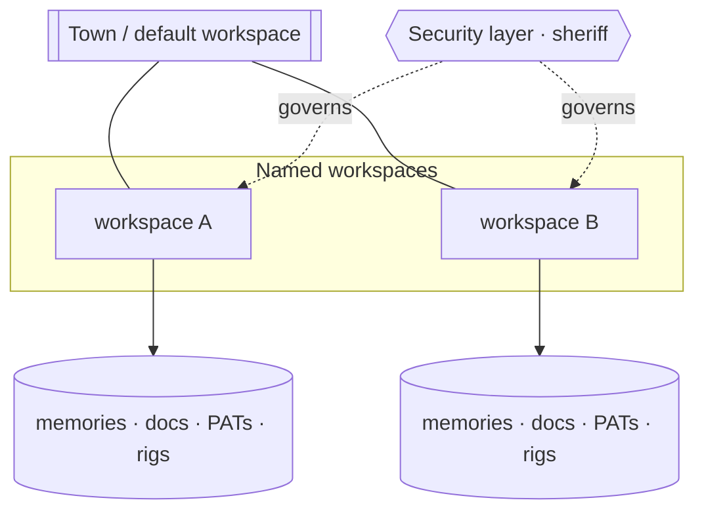

# Workspaces & security

The platform is multi-tenant. A **workspace** is a tenant boundary: its
memories, documents, PATs, and rig catalog are scoped to it. There is a reserved
town-level workspace for platform-wide data; product work happens in named
workspaces.

## Granular RBAC

Access is enforced by role scopes, and grants are always **enumerated**, never
wildcards:

- Grant `memory.recall`, `memory.save`, `a2a.inbox`, `a2a.delegate` — **not**
  `memory.*` or `a2a.*`.
- Policy is governed centrally in the **security layer** (the sheriff role /
  `role.sheriff` domain), so there is a single point of control and true least
  privilege.

When a feature fails with `unauthorized`, the fix is to identify the exact scopes
it uses and add them enumerated to the role — not to widen to a wildcard.

## Sessions

Auth is cookie-based (`gt_web_token`), same-origin across the console (`/app`),
docs (`/`), and the backend (`/auth`, `/api`). A signed-in session on one surface
is a signed-in session on all of them.

> **Improvement areas.** Because grants are enumerated per scope, adding a new
> capability means updating role policy in lockstep; a scope catalog with
> coverage checks would catch a capability shipped without a matching grant.
