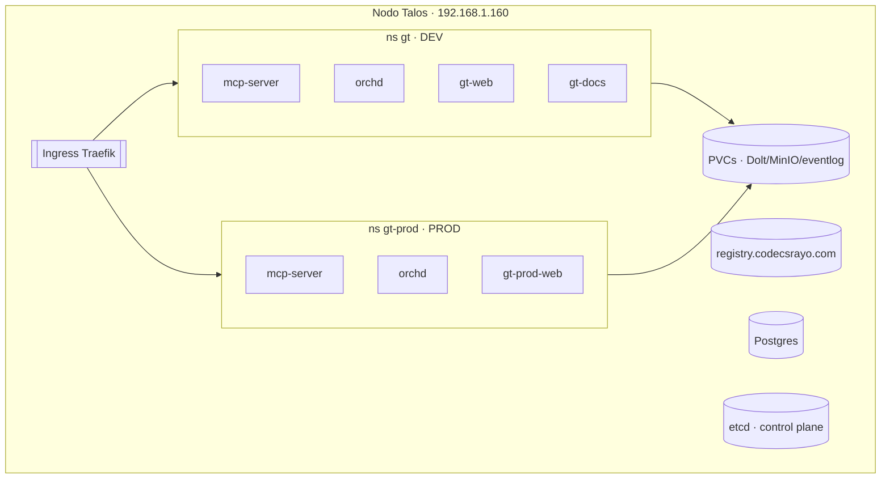

# Topología del cluster

La plataforma corre sobre un **cluster Kubernetes Talos de un solo nodo** (Talos
v1.13.4) en `192.168.1.160`. Un nodo aloja **dos entornos** — dev y prod — lado a
lado, más los servicios de infraestructura compartidos.

## Dos entornos, un nodo

| | Dev | Prod |
| --- | --- | --- |
| Namespace | `gt` | `gt-prod` |
| Host | `gt-dev.codecsrayo.com` | `gt.codecsrayo.com` |
| Dev loop | Tilt (editar → build → push → redeploy) | Helm + reconcilers |
| Imágenes | registry interno `:dev` | Docker Hub `:sha-…` |

Prod es greenfield — la máquina era el viejo host de prod, wipeada para Talos, así
que no hay datos migrados.

## Acceso a la config

- `talosctl` v1.13.4; `TALOSCONFIG=talos/_out/talosconfig`.
- `KUBECONFIG=talos/_out/kubeconfig` (contexto `admin@gt-core`).
- Machine config aplicada con
  `talosctl apply-config -n 192.168.1.160 --file … --mode=auto`.

Talos aplica el PodSecurity **baseline** en todo el cluster; un namespace que
necesita `hostPath`/`hostPort` debe etiquetarse
`pod-security.kubernetes.io/enforce=privileged`.

> **Áreas de mejora.** etcd, dev y prod comparten un solo NVMe. El I/O de builds
> Rust de los agentes ha saturado el disco y ahogado etcd — un disco dedicado para
> etcd es el fix definitivo (ver [gotchas operativos](/es/infrastructure/operational-gotchas)).
