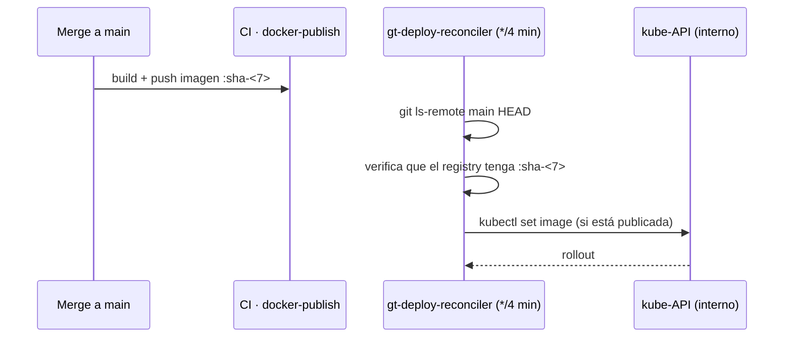

# Reconcilers de deploy

Las imágenes de dev y prod siguen `main` **automáticamente**, sin un job de deploy
hospedado en GitHub. **CronJobs** in-cluster reconcilian cada deployment contra la
imagen construida para el HEAD de `main`, corriendo cada 4 minutos contra el
kube-API interno.

## Qué reconcilia

- **gt-core**: `orchd` (`gt-core-orchd:sha-<7>`) y `mcp-server`
  (`gt-core-mcp-server:sha-embeddings-<7>`). El orchd de prod corre también la
  imagen embeddings.
- **gt-web**: una instancia de reconciler separada (su propio repo → su propio
  SHA), `codecsrayo/gt-web:sha-<7>`, misma imagen en dev y prod.

No hay Argo/Flux: el chart se aplica a mano con
`helm template <release> … --show-only templates/<t>.yaml | kubectl apply -n <ns>`
(el `-n` es obligatorio, o los recursos caen en `default`). Los reconcilers
mantienen las imágenes al día cuando Tilt no corre. `gt-docs` prod hoy se promueve
manualmente.

## Dos notas de race/robustez conocidas

1. **Race de ImagePull** — el reconciler fija el SHA en cuanto mergea `main`, pero
   `docker-publish` tarda ~10–13 min. Hay una ventana donde la imagen pedida aún no
   existe y el pod queda en `ImagePullBackOff`; se auto-cura cuando la imagen
   publica. No intervengas.
2. **Gate de registry-check** — el reconciler bloquea el roll **solo** en un `404`
   definitivo; procede en `200/000/401/5xx` y deja que el backoff de pull del
   kubelet absorba un miss transitorio (un token flaky de Docker Hub lo trababa).

> **Áreas de mejora.** Un reconciler puede rodar una imagen *rota* en el HEAD de
> `main` (p.ej. una migración PG en crashloop). Estabilizá suspendiendo el CronJob
> y haciendo `kubectl set image` a un SHA conocido-bueno hasta que aterrice el fix.
