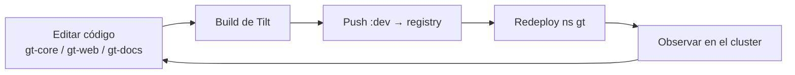

# Dev loop (Tilt)

El entorno de dev (namespace `gt`, `gt-dev.codecsrayo.com`) se maneja con un inner
loop de **Tilt**. Editás el código en los clones locales, y Tilt construye, pushea
al registry interno y redeploya en el cluster.

## Repos

| Repo | Rol |
| ---- | --- |
| `gt-core` | Servidor MCP / orchd / plataforma en Rust |
| `gt-app-proxy` | Helm chart + runbook de deploy |
| `gt-web` | Consola SvelteKit (SSR) |
| `gt-docs` | Docs en Astro (SSR) — este sitio |

La infra-as-code (Tiltfile, valores del chart, patches, runbook) vive en el repo
`gt-cluster`, cuyo árbol git está enraizado en `/home/nixos/talos`.

## Dev vs los reconcilers

Tilt es el **dev loop**; los [reconcilers de
deploy](/es/infrastructure/deploy-reconcilers) mantienen las imágenes al día cuando
Tilt no corre. Ambos apuntan al mismo namespace `gt`, así que un reconciler
corriendo rodará un deployment de dev al HEAD de `main` si Tilt soltó el control.

> **Áreas de mejora.** Construir imágenes Rust presiona el NVMe compartido. Mantené
> el pool acotado y preferí construir fuera del nodo o con caché tibia para no
> competir con el I/O de etcd.
