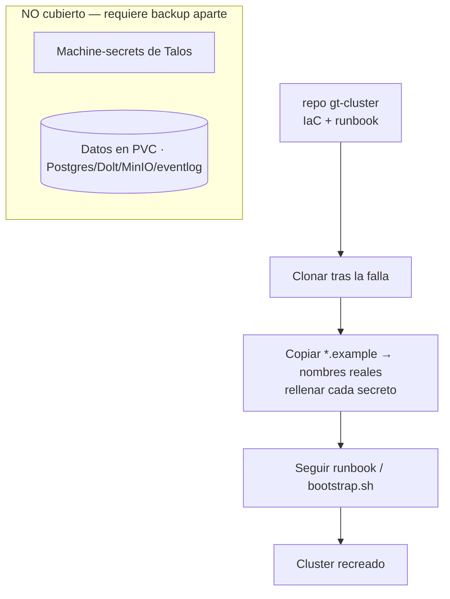

# Disaster recovery

La infraestructura del cluster está versionada como código en el **repo público
`gt-cluster`** para poder recrearla si la workstation falla. Captura el Tiltfile,
el runbook de deploy, los valores del chart y los patches de Talos — con todos los
secretos omitidos.

## Qué está versionado

Tiltfile, runbook, `bootstrap.sh`, labels PSA, valores dev/prod, valores de
registry y Traefik, y los patches de Talos. Dos secretos inline se reemplazaron por
placeholders en archivos `*.example`: el htpasswd del registry y la auth key de
Tailscale. Recuperación = clonar → copiar cada `*.example` a su nombre real y
rellenar el secreto → seguir el runbook.

## Los dos gaps

El disaster recovery completo **no** lo cubre el repo solo:

1. **Machine-secrets de Talos** — los certs/tokens de máquina (en `_out/`) están
   gitignored y sin backup.
2. **Los datos** — Postgres, Dolt, MinIO y el event log viven en PVCs; necesitan un
   backup aparte.

Ambos requieren un mecanismo de backup fuera del repo de IaC.

> **Áreas de mejora.** Cerrá los dos gaps con backups programados y fuera-del-nodo
> de los machine-secrets de Talos y los volúmenes PVC; sin ellos, perder el nodo es
> perder datos aunque la infra sea reproducible.
