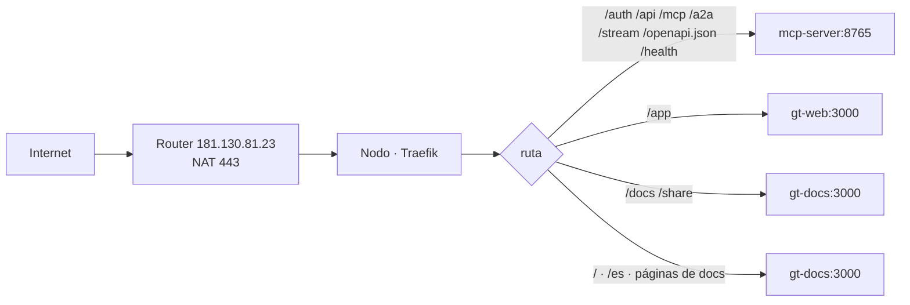

# Red y enrutamiento

Todo se sirve **same-origin** detrás de un único proxy inverso Traefik por
entorno. Un Ingress estándar resuelve por longest-prefix match, así que las rutas
explícitas de API y apps ganan al catch-all `/`.

## Mapa de rutas

| Ruta | Backend |
| ---- | ------- |
| `/auth` `/api` `/mcp` `/a2a` `/stream` `/openapi.json` `/health` `/.well-known` | mcp-server:8765 |
| `/app` | gt-web (consola) |
| `/docs` `/share` | gt-docs (browser de workspace + visor de share) |
| `/` · `/es` · `/<category>/<slug>` | gt-docs (este sitio de documentación) |

> Este mapa refleja el layout **docs-en-la-raíz**: el sitio de documentación es
> dueño de `/` y la consola gt-web se movió a `/app`. Los prefijos reservados de
> arriba no deben usarse como slugs de doc de top-level, por eso las páginas viven
> bajo `/<category>/<slug>`.

## Camino público y TLS

El router (`181.130.81.23`) NATea `443` al nodo; los hostnames públicos terminan en
el Traefik in-cluster. El TLS se emite vía **Let's Encrypt DNS-01 a través de
Netlify** (resolver ACME `netlify`); los Ingresses usan las anotaciones Traefik
`router.entrypoints=websecure` + `router.tls.certresolver=netlify`, con
`ingress.tls.enabled=false`.

> **Áreas de mejora.** Todo el tráfico público pasa por un solo NAT del router
> hogareño y un solo nodo. No hay redundancia; una caída de cualquiera de los dos
> deja dev y prod offline.
