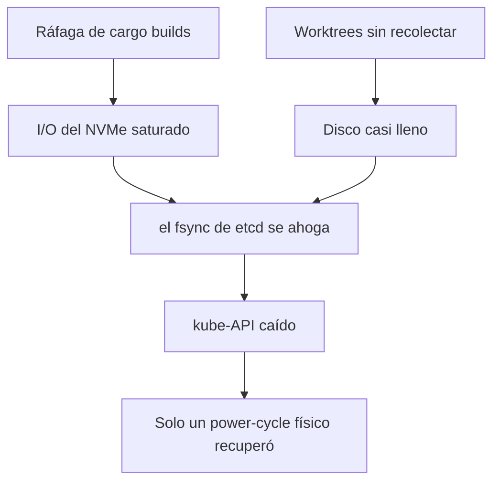

# Gotchas operativos

Las lecciones que costaron un incidente. Leé esto antes de operar el cluster.

## kube-API por LAN, no por Tailscale

`kubectl` contra el endpoint Tailscale (`100.76.199.82:6443`) puede colgarse con un
TLS handshake timeout desde la workstation aun con el cluster sano. Apuntá al
**endpoint LAN** en su lugar — el cert del API lo cubre, así que no hace falta el
flag `--insecure`:

```
kubectl config set clusters.gt-core.server https://192.168.1.160:6443
```

## Saturación de I/O de etcd en el NVMe compartido

Los builds Rust de los agentes más dev/prod comparten un solo NVMe. Una ráfaga de
`cargo build` ha saturado el I/O, empujado el `fsync` de etcd a varios segundos y
tumbado el kube-API; una fuga de disco por worktrees sin recolectar lo empeoró.



Con etcd ahogado, `kubectl` y `agent_kill` ambos timeoutean, y un reboot por
software se traba en el disco colgado — la única salida fue un **power cycle
físico**. Curado de raíz con GC de worktrees + un orquestador disk-aware; el pool
está acotado (`poolSize` 4, dev 6) y un **disco dedicado a etcd** es el fix
definitivo que sigue trackeado.

## Nunca corras tests contra la base de datos viva

Una suite de tests de agente corrió una vez `DROP SCHEMA … CASCADE` contra la
Postgres viva y wipeó el workspace de dev. El exec del polecat ahora strippea
`GT_PG_URL` / `GT_PG_AUDIT_URL` / `GT_DOLT_URL` para que ningún test de agente
alcance datos de prod. Los tests deben asertar un DSN **efímero** antes de tocar
una base de datos.

## Revertir un evento persistido requiere un tombstone

En un dominio event-sourced, no podés borrar un variant una vez que escribió
eventos — la replay fallaría con `unknown variant` y rompería a todos los
consumidores. Revertí dejando un **tombstone**: el variant sigue decodificando
(misma forma) pero su `apply` es no-op y nunca se emite de nuevo.

> **Áreas de mejora.** La mayoría de esto se atrapó después del hecho. Agregá
> guards pre-merge (aserciones de DSN efímero, tests de round-trip de eventos) y
> alertas de disco/latencia de etcd para que el próximo se atrape antes de paginar.
