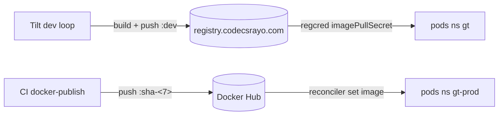

# Registry e imágenes

El cluster corre un **registry de contenedores in-cluster** en
`registry.codecsrayo.com` (TLS Let's Encrypt + basic auth). Las imágenes de dev se
pushean y pullean de ahí; las de prod vienen de Docker Hub vía los reconcilers.

## Variantes de imagen

| Imagen | Dónde | Notas |
| ------ | ----- | ----- |
| `gt-core-mcp-server:sha-embeddings-<7>` | dev + prod | Variante embeddings pesada que corre el cluster |
| `gt-core-orchd:sha-<7>` | dev | orchd lean (el orchd de prod corre la imagen embeddings) |
| `codecsrayo/gt-web:sha-<7>` | dev + prod | Imagen lean única, sin variante embeddings |
| `codecsrayo/gt-docs` | dev + prod | Este sitio de docs |

## Autenticación de pull

Cada namespace de app pullea vía un **imagePullSecret** `regcred`. La
`machine.registries.config.auth` de Talos **no** funciona acá — containerd no la
recarga y CRI no se puede reiniciar por la API — así que los pull secrets por
namespace son el mecanismo.

> **Áreas de mejora.** El password basic-auth del registry vive en secrets del
> cluster y (sanitizado) como placeholder en el repo de infra. Rotarlo implica
> actualizar el `regcred` de cada namespace; un único secret sourced reduciría el
> drift.
