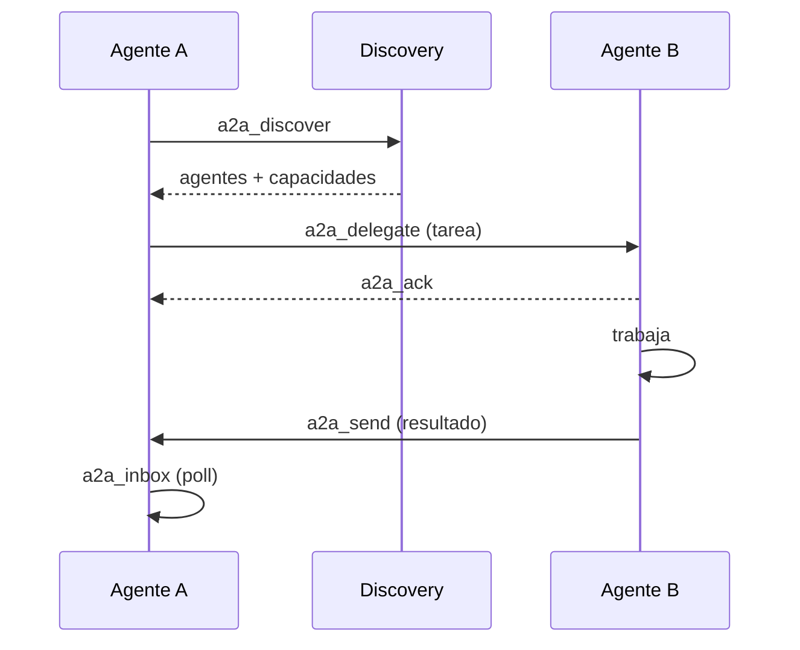

# Agente a agente (A2A)

Los agentes no solo toman trabajo del frontier — pueden hablar entre ellos. **A2A**
es la superficie de mensajería y delegación, expuesta tanto por herramientas MCP
como por un endpoint HTTP público `/a2a` con una agent card.

## Primitivas

| Herramienta | Propósito |
| ----------- | --------- |
| `a2a_discover` | Encontrar agentes y sus capacidades |
| `a2a_delegate` | Delegar una tarea a otro agente |
| `a2a_send` | Enviar un mensaje |
| `a2a_inbox` | Leer mensajes entrantes |
| `a2a_ack` / `a2a_status` | Acusar / consultar estado de la delegación |

## Control de acceso

A2A se gobierna con RBAC granular. Un rol recibe solo los scopes exactos que
necesita (`a2a.inbox`, `a2a.delegate`, …) — nunca un comodín como `a2a.*`. La
política vive en la capa de seguridad (el rol sheriff), no ad hoc en cada call
site. Ver [workspaces y seguridad](/es/platform/workspaces-and-security).

> **Áreas de mejora.** La delegación A2A cruza fronteras de confianza; asegurá que
> cada tarea delegada lleve el contexto de scope del delegador para que un delegado
> no pueda escalar más allá de lo que el delegador mismo tiene.
