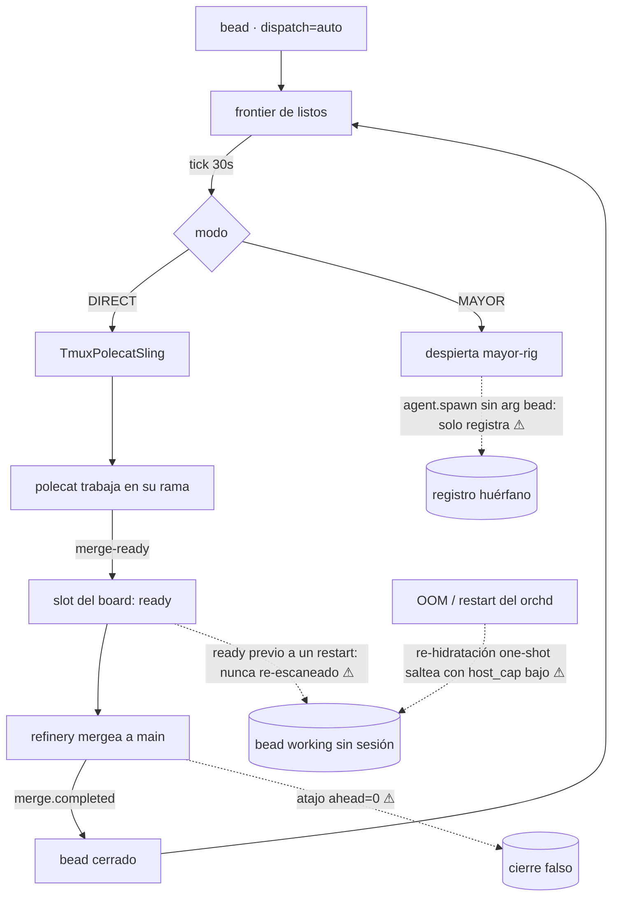

# Ciclo de trabajo de los agentes

Esta página audita el **ciclo autónomo completo** — de un bead abierto a un
commit mergeado y un bead cerrado — etapa por etapa, marcando qué está
implementado, qué está parcial y qué está roto. Cada afirmación se apoya en el
código de gt-core (símbolos nombrados) o en el incidente de producción del
2026-07-01/02. Para los conceptos en sí, ver [dispatch](/es/platform/dispatch)
y [roles y agentes](/es/platform/roles-and-agents).

## Estado por etapa

| Etapa | Mecanismo | Estado |
|---|---|---|
| Frontier | `FrontierSource` + readiness + `resolve_dispatch` | ✅ sólido |
| Dispatch DIRECT | `SchedWorker` slinga por bead, reintenta cada tick | ✅ sólido |
| Dispatch MAYOR | wake file + el mayor delega | ⚠ **eslabón roto** (G1) |
| Sling | credential guard → worktree → tmux → prompt | ⚠ parcial (G3, G4) |
| Trabajo | commits + checkpoint-push + notas `## Checkpoint` | ✅ sólido |
| Recuperación | re-sling del supervisor (`max_restarts=3`), reconciler | ⚠ parcial (G2) |
| Merge | el refinery consume el canal MERGE_READY | ⚠ parcial (G5) |
| Cierre | `merge.completed` → cierre del bead | ⚠ puede cerrar sin entrega (G5) |

Cuando todos los eslabones aguantan, el ciclo **sí** entrega end-to-end sin
humanos: el PR #30 de gt-web (fix del polling 401 con sesión expirada, 42
líneas sobre el surface exacto del bead) se implementó, submiteó, mergeó y
cerró de forma autónoma el 2026-07-02.

## Gaps verificados

**G1 — el mayor no puede slingar de verdad.** `mayor_prompt`
(`mayor_dispatch.rs`) le dice al mayor que "delegue vía las herramientas MCP"
pero nunca nombra la única llamada que materializa trabajo: `agent.spawn`
**con el argumento `bead`**, cuyo handler (`mcp/agent.rs`) puentea al
scheduler del orchd *solo* si hay un dispatch sink cableado — si no, "spawn
only records the event", y el puente es explícitamente best-effort ("a failure
logs but never fails the spawn call"). Observado el 2026-07-02: un mayor
"re-slingó" seis beads; los seis fueron registros del tracker sin proceso
tmux, orphan-killed por el session reconciler ~2 min después, en silencio. El
cluster se pasó a DIRECT hasta que este eslabón se arregle.

**G2 — la re-hidratación de boot es one-shot y ciega al cap.** Tras un
restart, el orchd re-slinga los beads `working` una sola vez.
`host_cap_from_metrics` → `compute_host_cap` (polecat.rs) gatea la admisión
por RAM + PSI de IO; justo después de un OOMKill esas métricas están
deprimidas, el cap puede computar 1 y la re-hidratación saltea el resto
(`sling skipped … pool/host cap reached`). El cap se recupera en un timer,
pero **nada reintenta jamás los beads salteados**: un bead `working` sin
sesión es invisible para el frontier para siempre. Dos OOMKills el
2026-07-01/02 orfanaron ~6-8 beads cada uno; la recuperación exigió que un
operador los devolviera a `open`.

**G3 — los diálogos interactivos se comen el prompt del sling.** Una sesión
`claude` recién slingada puede caer en el diálogo de confianza de carpeta o en
un promo de feature; el prompt del bead inyectado lo consume el diálogo y el
polecat queda idle en un prompt vacío, latiendo, indistinguible de un agente
trabajando.

**G4 — una credencial muerta puede pasar el guard del sling.** Una cuenta
cuyo `.credentials.json` perdió el access token sigue leyendo `Refreshable` /
`needs_relogin=false` en `quota.cred_health`; un polecat slingado con ella
nace en "Not logged in" mientras su bead figura `working`.

**G5 — el refinery confía en el board, no en git.** Tres huecos
relacionados: (a) solo consume el *canal* MERGE_READY — los slots ya `ready`
antes de un restart nunca se re-escanean; (b) `failed` es terminal (70/108
slots al momento de la auditoría) sin `merge_reset`; (c) el atajo ahead=0
(commit `4f9d9bc`) marca un slot `merged` cuando la rama no tiene commits
sobre main — lo que **cerró el bead gtcore-4ad682 con `delivered_sha=null`
mientras su feature (`merge_reset`, irónicamente) no existe en el código**. El
ciclo puede reportar trabajo hecho que nunca ocurrió.

**G6 — los daemons no laten.** Los registros de sesión de
sheriff/deacon/refinery llevan `last_heartbeat_at=null`, así que un daemon
zombie es indistinguible de uno vivo en `agent.list`.

**G7 — desincronización board/git.** El slot `gtcore-065009` sigue en `ready`
mientras un commit de retención de sesiones que calza con su alcance está en
el HEAD de main; el slot `gtcore-4ad682` figura `merged` sin nada aterrizado.
Ninguna dirección se reconcilia contra la verdad de git.

## Beads abiertos que cierran estos gaps

El epic `gtcore-9d8e6b` agrupa los bugs nuevos de la auditoría:
`gtcore-d24661` (eslabón de delegación del mayor — G1, PR #164),
`gtcore-03be6a` (gate de evidencia ahead=0 — G5c, PR #165) y
`gtcore-f527f6` (retry del sling parqueado por cap — G2, PR #166). Ya
trackeados aparte: `gtcore-088db9` (reconcile del board al boot del refinery
— G5a), `gtcore-b69087` (restart de daemons — adyacente a G1/G6),
`gtcore-efb7e6` (heartbeats de daemons — G6), `gtcore-f396dc` (diálogos del
prompt del sling — G3), `gtcore-945c70` (guard de credenciales — G4), más el
reabierto `gtcore-4ad682` (merge_reset — G5b).

> **Áreas de mejora.** El problema más profundo es que el fallo es
> *silencioso* en cada eslabón roto: un spawn que no materializa nada, un
> re-sling salteado, un prompt comido por un diálogo y un "merge" ahead=0
> dejan el tracker con aspecto sano. Cada fix de gap debería llevar una señal
> visible para el operador (notificación o heartbeat), no solo el cambio de
> estado.
