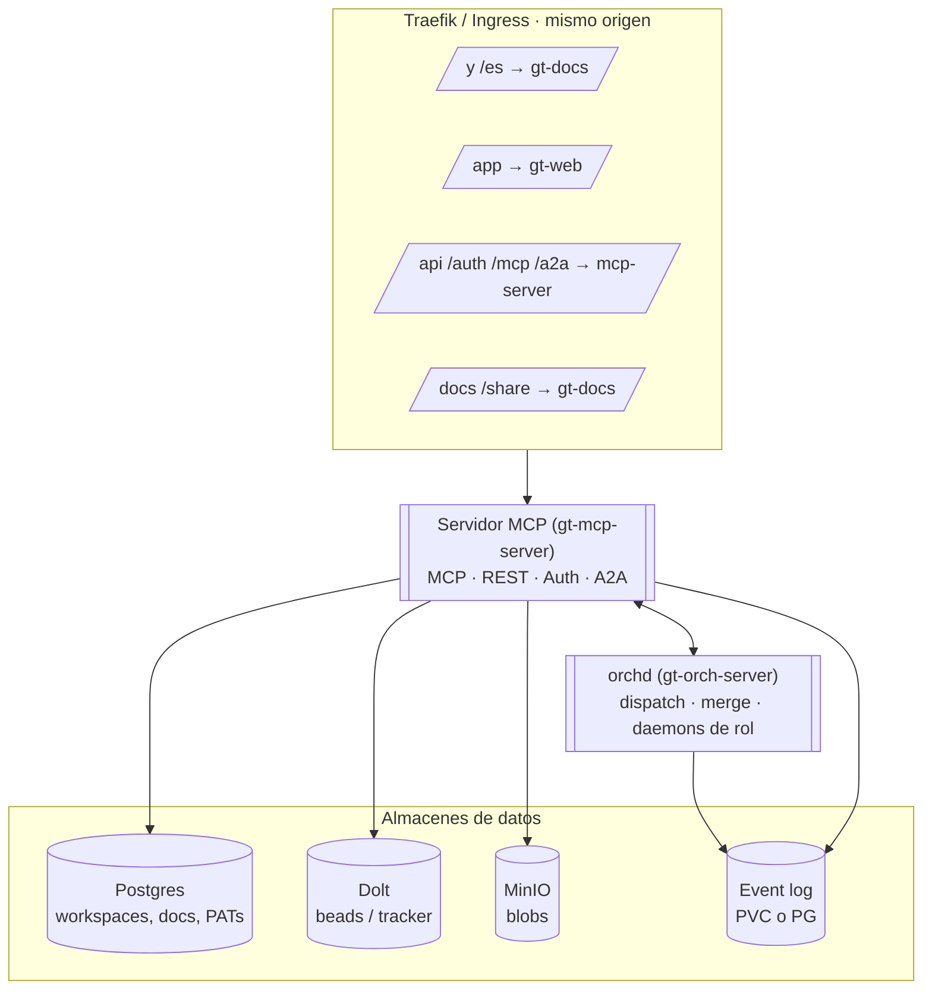

# Arquitectura

El runtime de la plataforma son dos binarios Rust, más dos frontends SSR y un
conjunto de almacenes de datos. Todo es same-origin detrás de un único proxy
inverso.

## Componentes

- **Servidor MCP** (`gt-mcp-server`) — la puerta de entrada. Sirve la superficie
  de herramientas MCP, la API REST (`/api/v1`), auth (`/auth`) y agent-to-agent
  (`/a2a`). Es dueño de los almacenes de datos.
- **orchd** (`gt-orch-server`) — el orquestador singleton. Corre el loop de
  dispatch, el daemon de merge (refinery) y los daemons de rol. Forkea sesiones de
  agente (`claude` en tmux) dentro del pod.
- **gt-web** — consola SvelteKit SSR, servida bajo `/app`.
- **gt-docs** — docs en Astro SSR, servidas en `/` (este sitio) más el browser de
  `/docs` y el visor público `/share`.

## Almacenes de datos

| Almacén | Guarda |
| ------- | ------ |
| **Postgres** | Workspaces, usuarios, PATs, catálogo de rigs, memorias, documentos, comentarios |
| **Dolt** | Beads / tracker (versionado) |
| **MinIO** | Blobs de documentos |
| **Event log** | Eventos de dominio para replay (PVC file-backed en dev, opción PG) |

Varios dominios son **event-sourced**: el estado es un replay de un log de solo
anexado. Eso hace los reverts sutiles — ver [beads y epics](/es/platform/beads-and-epics)
y la regla de tombstone en [gotchas operativos](/es/infrastructure/operational-gotchas).

> **Áreas de mejora.** El servidor MCP depende del bookkeeping de migraciones para
> crear tablas por-workspace; un `ensure_schema` al boot (CREATE TABLE IF NOT
> EXISTS) permitiría que una tabla dropeada se auto-cure en vez de requerir un
> re-apply manual.
