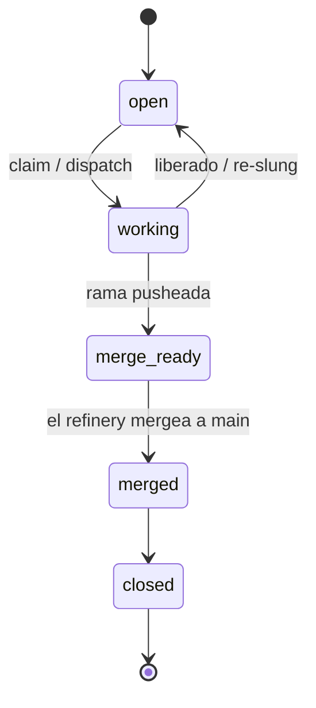

# Beads y epics

Un **bead** es la unidad atómica de trabajo — un bug, tarea o feature. Un **epic**
es un contenedor: no tiene código propio, y su entrega es la suma de sus beads
hijos, cada uno mergeado en su propia rama. Un epic se cierra cuando todos sus
hijos aterrizan.

Todo cambio sigue el mismo flujo, en orden:

1. **Crear** el bead/epic.
2. **Editar** con contexto suficiente — el *por qué*, alcance, enlaces.
3. **Reclamar** (claim).
4. **Resolver** — hacer el trabajo en una rama.
5. **Actualizar** — registrar el resultado.
6. **Cerrar.**

El punto es la trazabilidad: el trabajo queda ligado a un item con historia, nunca
a cambios sueltos sin origen.

## Ciclo de vida

## Flag de dispatch

Un bead lleva un ajuste **dispatch**:

- `auto` — el orquestador puede meterlo en el *frontier* de listos y despacharlo.
- `manual` — nunca entra al frontier por sí solo (salvo un miembro activo de
  convoy, vía el gate de convoy).

Para entregar trabajo a los agentes, poné los beads-hoja en `dispatch=auto`; el
frontier del orchd (`GT_AUTO_DISPATCH_TICK_SECS=30`) los recoge.

## Reglas para los agentes

- Un agente slung sobre un **epic** **no** debe implementarlo ni mergearlo — lista
  los hijos y se detiene.
- Un agente re-slung sobre un bead cuyo entregable **ya está mergeado** (rama
  stale) **no** debe re-mergear — re-mergear una rama stale revierte trabajo más
  nuevo. Deja una nota (surface) y se detiene.

Ambos son casos duros de "surface + stop"; el canal correcto es una nota en el
bead.

> **Áreas de mejora.** La re-hidratación al boot del orchd históricamente re-slingó
> beads cerrados/epic/`manual`; el frontier debe excluir `issue_type=epic` y
> respetar `dispatch=manual` en la rehidratación para evitar trabajo duplicado o
> destructivo.
