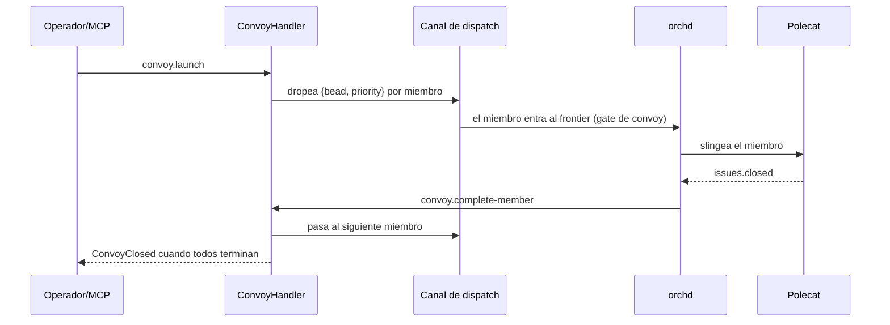

# Convoys

Un **convoy** es un grupo coordinado de beads que deben trabajarse juntos. Tiene
miembros, cada uno se vuelve una unidad despachable, y avanza a medida que sus
miembros completan.

## Los dos gaps que hubo que cerrar

Los convoys no avanzaban end-to-end hasta que se cerraron dos gaps:

1. **Gate de dispatch** — los miembros son `dispatch=manual`, así que el chequeo
   de slingability los skipeaba. Ahora un **override de convoy** permite slingear
   a un *miembro activo de un convoy lanzado* pese a `manual` (los beads
   closed/epic siguen bloqueados).
2. **Completion** — nada traducía `issues.closed` a `convoy.complete-member`.
   Ahora un **plugin de completion** reacciona a `issues.closed` y pasa al
   siguiente miembro o cierra el convoy.

El puente de `convoy.launch` al canal de dispatch ya estaba cableado; estas dos
adiciones hicieron el loop autónomo.

## Controles manuales

Si un convoy queda trabado, un operador puede avanzarlo a mano con
`convoy.complete-member` / `convoy.reconcile`, o poniendo un bead-miembro en
`dispatch=auto`.

> **Áreas de mejora.** El progreso del convoy depende de que el orchd emita
> eventos de ciclo de vida del agente; asegurá que re-slings y reconciles sean
> idempotentes para que un `issues.closed` replayado no duplique el handoff de un
> miembro.
