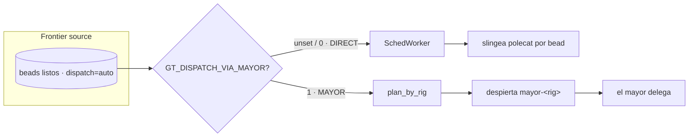

# Dispatch

El loop de auto-dispatch del orchd lee el **frontier** de listos (beads elegibles)
y lo convierte en trabajo de agente. Corre en uno de dos modos, seleccionado por
`GT_DISPATCH_VIA_MAYOR` y gateado en `GT_AUTO_DISPATCH=1`.

## Modo DIRECT

Comportamiento legacy: el orchd es dueño del dispatch. `FrontierSource →
SchedWorker` slingea un polecat por bead, y un plugin de completion libera el slot
cuando el bead aterriza.

## Modo MAYOR — actual

El cluster corre **modo MAYOR** (`dispatchViaMayor: true`). El dispatcher agrupa el
frontier por prefijo de rig y despierta **un mayor por rig** (sesión tmux
`mayor-<rig>`), entregándole el frontier de listos. El mayor coordina
bead-por-bead y delega a polecats, y se anuncia como sesión observable.
Wake-on-task: un frontier vacío no despierta a nadie (≈0 tokens en idle); un mayor
que muere se re-slinga en el próximo tick si ese rig aún tiene trabajo.

## Credenciales

Una sesión de mayor resuelve credenciales al spawnear (keychain + quota), igual que
un polecat, así que nunca nace sin autenticar. Abortar el spawn cuando no hay
cuenta válida es preferible a lanzar un mayor que daría 401.

## Repartir trabajo

Poné los beads-hoja en `dispatch=auto`; el tick del frontier del orchd
(`GT_AUTO_DISPATCH_TICK_SECS=30`) los mete y el mayor del rig delega. Un bead
`dispatch=manual` nunca entra al frontier salvo que sea miembro activo de convoy.

> **Áreas de mejora.** Reiniciar el orchd mata las sesiones tmux de polecat en
> vuelo y re-orfana sus beads. Los cambios de config que requieran reinicio del
> orchd deben batchearse y programarse contra un frontier tranquilo.
