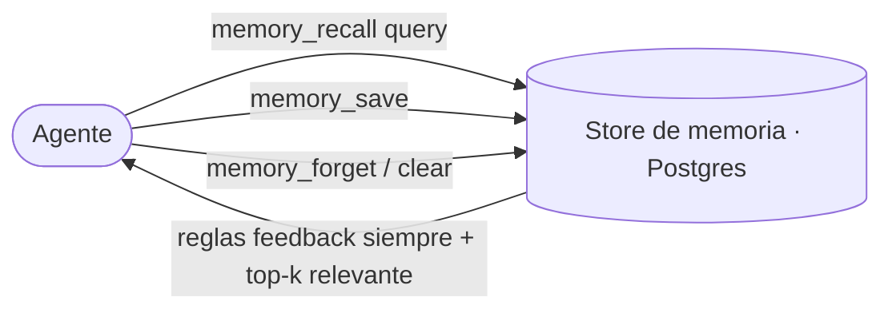

# Memoria

La plataforma mantiene una **memoria** durable respaldada por MCP — hechos que los
agentes recuerdan antes de actuar y guardan a medida que aprenden. Es la única
fuente de verdad del conocimiento operativo; **no** se guarda en archivos locales
dispersos.

## Kinds

| Kind | Qué guarda |
| ---- | ---------- |
| **user** | Quién es el operador — rol, preferencias |
| **feedback** | Cómo deben trabajar los agentes — correcciones y enfoques confirmados, con el *por qué* |
| **project** | Trabajo en curso, objetivos, restricciones no derivables del código |
| **reference** | Punteros a how-tos, endpoints, recursos externos |

## Semántica del recall

`memory_recall` **siempre** devuelve cada regla `feedback` completa, más el top-k
del resto por relevancia. Eso garantiza que las reglas de comportamiento nunca se
pierdan, mientras que los hechos project/reference se traen por significado.

## Higiene

- Un hecho por memoria; actualizá el archivo existente en vez de duplicar.
- Convertí fechas relativas a absolutas.
- Borrá memorias que resulten equivocadas.
- Enlazá memorias relacionadas para que un tema quede navegable.

Las memorias recordadas reflejan lo que era cierto al escribirlas — verificá que un
archivo, flag o endpoint nombrado siga existiendo antes de actuar sobre él.

> **Áreas de mejora.** La memoria puede driftar del sistema vivo (un flag o tabla
> nombrado pudo haberse movido). Un reconcile periódico que marque referencias
> stale mantendría el recall confiable.
