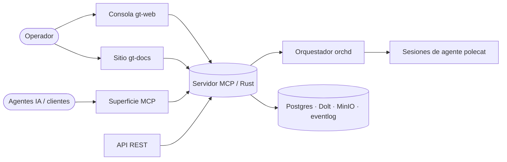

# Visión general de la plataforma

**gt** es una plataforma auto-alojada para llevar adelante trabajo de software con
agentes de IA. Un backend en Rust (el **servidor MCP**) expone el sistema por
varias superficies; un orquestador (**orchd**) despacha sesiones de agente que
reclaman unidades de trabajo, las implementan en su propia rama de git y las
mergean de vuelta a `main`.

Todo cambio pasa por una unidad de trabajo trazada — un **bead** (o un **epic**
que agrupa beads). Los agentes toman beads listos, hacen el trabajo y lo
aterrizan. Los operadores humanos observan y guían desde la consola web y la
documentación que estás leyendo.

## Superficies

| Superficie | Ruta | Público |
| ---------- | ---- | ------- |
| Consola (gt-web) | `/app` | Operadores — tracker, kanban, agentes, admin |
| Docs (gt-docs) | `/` · `/es` | Cualquiera — documentación del sistema (este sitio) |
| Docs de workspace | `/docs` | Usuarios con sesión — documentos + búsqueda |
| MCP | `/mcp` | Agentes / clientes Claude — herramientas por MCP |
| REST | `/api/v1/*` | Clientes programáticos + webhooks |
| Auth | `/auth/*` | Login, sesión, proveedores OIDC |

## Conceptos centrales

- **Beads y epics** — la unidad de trabajo y su ciclo de vida.
- **Roles y agentes** — mayor, polecat, refinery, sheriff, witness, deacon.
- **Dispatch** — cómo el trabajo listo llega a un agente (modo DIRECT vs MAYOR).
- **Convoys** — trabajo coordinado de varios miembros.
- **Memoria** — conocimiento durable que los agentes recuerdan y guardan.
- **Quota y credenciales** — acceso a modelos, rotado entre cuentas.
- **Workspaces y seguridad** — multi-tenencia y RBAC granular.

> **Áreas de mejora.** Este sitio documenta el sistema *tal como corre hoy* para
> que los huecos se detecten fácil. Cada página cierra con una nota de mejora
> donde hay una debilidad conocida o una decisión abierta.
