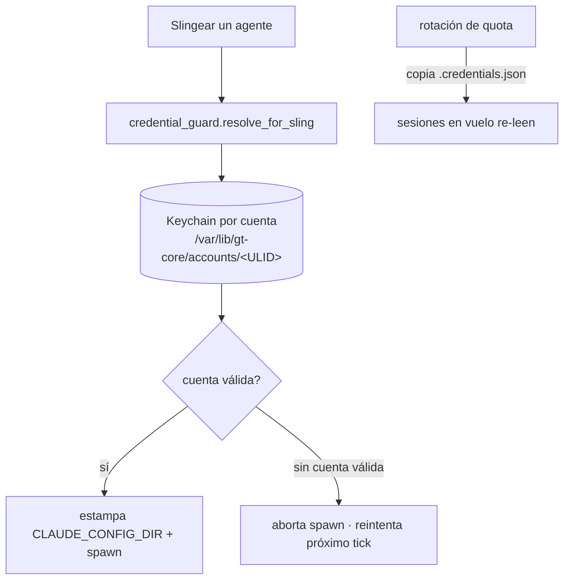

# Quota y credenciales

Los agentes corren el CLI `claude`, que necesita credenciales de modelo válidas. La
plataforma gestiona un pool de cuentas (**quota**) y resuelve la credencial
correcta para cada sesión de agente, rotando entre cuentas a medida que se agotan.

## Resolución por sesión

Tanto polecats como mayors resuelven credenciales **por sling** vía el credential
guard, estampando `CLAUDE_CONFIG_DIR` a un dir de keychain persistente por cuenta
en el PVC. Una sesión nunca se lanza contra una cuenta muerta: si no hay cuenta
válida el spawn aborta y el frontier reintenta en el próximo tick.

## Rotación en caliente

En la rotación de quota, el `.credentials.json` de la cuenta nueva se copia al dir
de config de cada agente en vuelo; el CLI lo re-lee, así que las sesiones largas
siguen trabajando sin reiniciar.

## Por qué las sesiones nacían en 401

El pod orchd usa `HOME=/tmp`, así que un **reinicio del pod borra las
credenciales** — hay que re-aprovisionarlas antes de despachar. Históricamente el
mayor waker usaba un snapshot estático del entorno al boot y heredaba una cuenta
stale; ahora resuelve credenciales al spawnear igual que el polecat.

> **Áreas de mejora.** Como las credenciales viven bajo el `HOME` efímero del pod,
> el aprovisionamiento debe correr en cada reinicio. Persistir la ruta del keychain
> resuelto independiente de `HOME` eliminaría ese paso por-reinicio.
