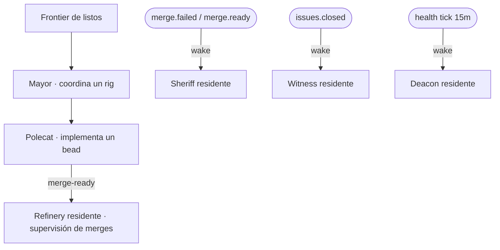

# Roles y agentes

El trabajo lo llevan sesiones de agente con roles distintos. Algunos los lanzan
operadores/coordinadores; los roles de infraestructura los gestiona el daemon
orchd.

| Rol | Trabajo | Cómo corre |
| --- | ------- | ---------- |
| **Mayor** | Coordina un rig; decide bead-por-bead y delega | sesión tmux residente por rig (`mayor-<rig>`) |
| **Polecat** | Implementa un bead en su propia rama | sesión tmux `claude` (visible en `agent_list`) |
| **Refinery** | Supervisión del pipeline de merge; el ff-merge mecánico sigue siendo un loop in-process | sesión residente (`refinery-resident`) |
| **Sheriff** | Devuelve el merge board a salud ante `merge.failed`/`merge.ready` | sesión residente (`sheriff-resident`) |
| **Witness** | Verifica que un bead cerrado cumplió sus criterios de aceptación | sesión residente (`witness-resident`) |
| **Deacon** | Escaneo periódico de salud del flujo (cada 15 minutos) | sesión residente (`deacon-resident`) |

## Sesiones residentes (`GT_ROLE_SESSIONS=1`, ajuste actual)

Cada rol de infra vive como **una sesión tmux de larga vida** con el patrón del
mayor: spawneada al boot del orchd, **idle-bloqueada en su wake file**
(`$GT_CHANNEL_ROOT/role-wake/<rol>.event`), y re-levantada por una pasada de
supervisión en menos de un minuto si muere. El idle cuesta ≈ 0 tokens — bloquear
en el archivo *es* el estado idle, la misma economía que compraba el modo
single-shot anterior, pero las sesiones son siempre visibles (`agent_list` las
muestra `working` con heartbeats frescos) y nunca dejan registros zombie.

Los triggers entregan **wakes** en vez de spawns nuevos: `merge.failed`/
`merge.ready` despiertan al sheriff, `issues.closed` al witness, el tick de
salud al deacon, y el canal on-demand a cualquiera. Los triggers rápidos se
coalescen (gana el último wake); los residentes re-leen el wake file tras cada
trigger atendido, así un wake que aterriza a mitad de turno nunca se pierde.
Con el flag apagado, el modo single-shot previo (`GT_ROLE_AGENTS=1`) queda
intacto.

## Quién puede spawnear qué

`agent_spawn` acepta `polecat` (con un `bead`, despachado por el scheduler) y
los roles de infra `refinery|sheriff|witness|deacon|overseer|dog` como
**solicitudes on-demand** — en modo residente la solicitud se convierte en un
wake del residente (con tu `reason` en el payload). `mayor` se rechaza: es el
único rol que el orquestador levanta por sí mismo. Una cola de merge trabada es
por tanto recuperable desde la consola: despierta al refinery/sheriff on-demand.

## Observabilidad

Los residentes anuncian su ciclo de vida (`agent.spawned`, heartbeats por pasada
que pliegan `spawned → working`, supersede-kill al re-levantar) y el session
reconciler del orchd cosecha cualquier registro cuyo tmux desapareció — un
residente muerto ya no puede quedar como fantasma `spawned` en `agent_list`.

> **Áreas de mejora.** El kickoff del residente confía en el `CLAUDE.md` de
> Knowledge del rol para misión/criterio; la disciplina de bloquear en el wake
> file se impone por prompt, no mecánicamente — un residente que haga busy-poll
> en vez de bloquear quemaría tokens de forma invisible hasta que el operador
> inspeccione su pane. Una alarma de presupuesto de tokens por rol cerraría ese
> hueco.
