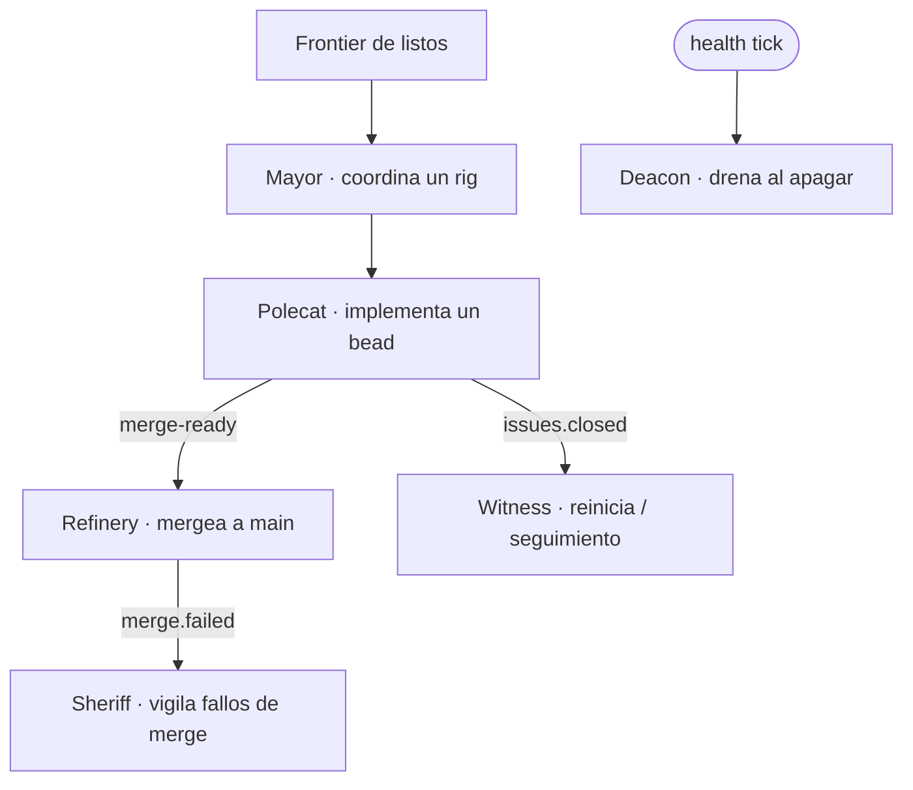

# Roles y agentes

El trabajo lo llevan sesiones de agente con roles distintos. Algunos los lanzan
operadores/coordinadores; los roles de infraestructura los gestiona el daemon
orchd.

| Rol | Trabajo | Cómo corre |
| --- | ------- | ---------- |
| **Mayor** | Coordina un rig; decide bead-por-bead y delega | sesión tmux por rig (`mayor-<rig>`) |
| **Polecat** | Implementa un bead en su propia rama | sesión tmux `claude` (visible en `agent_list`) |
| **Refinery** | Mergea ramas `merge-ready` a `main` | loop in-process en orchd |
| **Sheriff** | Vigila fallos de merge; dueño de la política RBAC | agente single-shot (role-agents on) |
| **Witness** | Reacciona a `issues.closed` | agente single-shot |
| **Deacon** | Drena worktrees al apagar | agente single-shot |

## Quién puede spawnear qué

`agent_spawn` solo acepta `mayor`, `dog` y `polecat`. Los roles de infraestructura
(refinery, sheriff, witness, deacon) los lanza el daemon orchd — un coordinador
**no** puede spawnearlos. Si la cola de merge queda trabada sin refinery, el fix es
escalar al operador/daemon, no spawnear uno.

## Observabilidad

Con **role-agents mode activo** (el ajuste actual), sheriff/witness/deacon corren
como sesiones single-shot que se anuncian (`agent.spawned` / `session-end` →
`agent_list` + audit) en vez de loops in-process invisibles. El refinery aún corre
como loop in-process en el orchd.

> **Áreas de mejora.** El refinery todavía no se anuncia como sesión de agente (es
> un consumidor de cola). Emitir su ciclo de vida cerraría el último hueco de
> "todo rol es una sesión observable".
