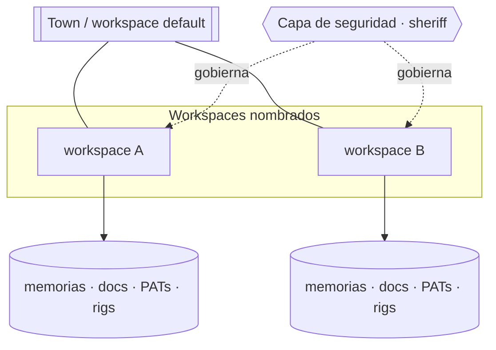

# Workspaces y seguridad

La plataforma es multi-tenant. Un **workspace** es una frontera de tenant: sus
memorias, documentos, PATs y catálogo de rigs están scopeados a él. Hay un
workspace reservado a nivel town para datos de toda la plataforma; el trabajo de
producto ocurre en workspaces nombrados.

## RBAC granular

El acceso lo aplica el scope del rol, y los grants son siempre **enumerados**,
nunca comodines:

- Otorgá `memory.recall`, `memory.save`, `a2a.inbox`, `a2a.delegate` — **no**
  `memory.*` ni `a2a.*`.
- La política se gobierna centralmente en la **capa de seguridad** (rol sheriff /
  dominio `role.sheriff`), así hay un único punto de control y mínimo privilegio
  real.

Cuando una feature falla con `unauthorized`, el fix es identificar los scopes
exactos que usa y agregarlos enumerados al rol — no ampliar a un comodín.

## Sesiones

La auth es por cookie (`gt_web_token`), same-origin entre la consola (`/app`), docs
(`/`) y el backend (`/auth`, `/api`). Una sesión iniciada en una superficie es
sesión iniciada en todas.

> **Áreas de mejora.** Como los grants son enumerados por scope, agregar una
> capacidad nueva implica actualizar la política del rol en sincronía; un catálogo
> de scopes con chequeos de cobertura atraparía una capacidad enviada sin su grant
> correspondiente.
